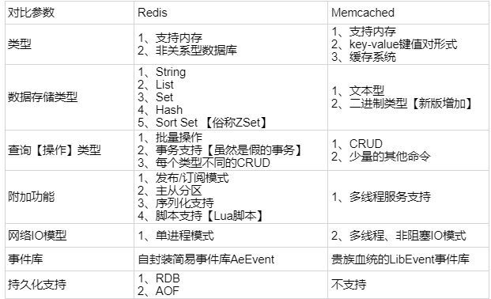
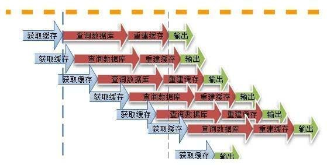
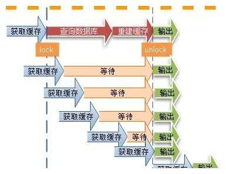
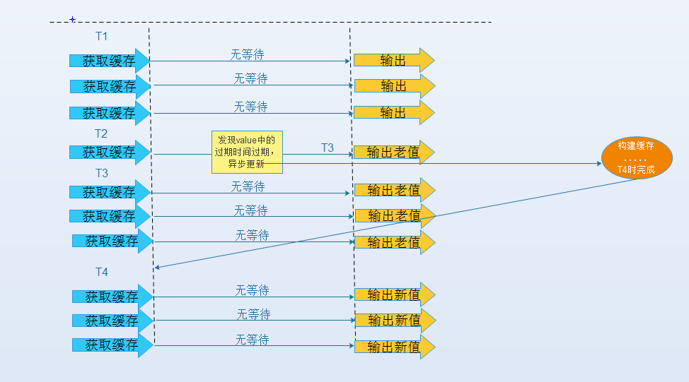
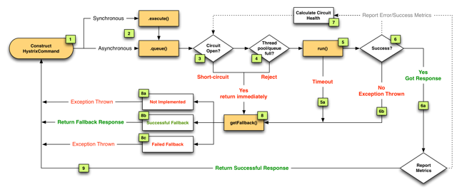
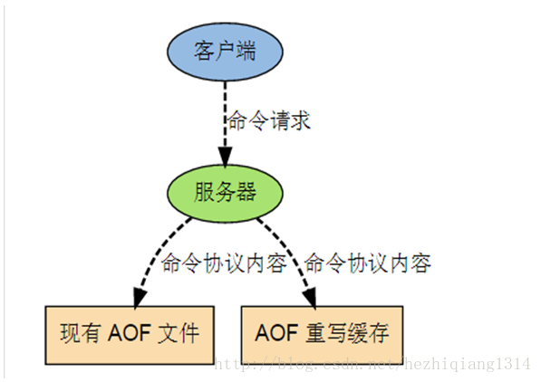

# Redis

参考地址：

Redis详细教程：[https://tuonioooo.gitbooks.io/high-concurrent-cache/content/redis.html](https://tuonioooo.gitbooks.io/high-concurrent-cache/content/redis.html)

**1**.**Redis 是什么？都有哪些使用场景？**

Redis 是一个使用 C 语言开发的高速缓存数据库。

Redis 使用场景：

* 记录帖子点赞数、点击数、评论数；
* 缓存近期热帖；
* 缓存文章详情信息；
* 记录用户会话信息。

**2. Redis 有哪些功能？**

* 数据缓存功能
* 分布式锁的功能
* 支持数据持久化
* 支持事务
* 支持消息队列

**3. Redis 和 memcache 有什么区别？**

* 存储方式不同：

  memcache 把数据全部存在内存之中，断电后会挂掉，数据不能超过内存大小；Redis 有部份存在硬盘上，这样能保证数据的持久性。

* 数据支持类型：

  memcache 对数据类型支持相对简单；Redis 有复杂的数据类型。

* 使用底层模型不同：它们之间底层实现方式，以及与客户端之间通信的应用协议不一样，

  Redis 自己构建了 vm 机制，因为一般的系统调用系统函数的话，会浪费一定的时间去移动和请求。

* value 值大小不同：Redis 最大可以达到 512mb；memcache 只有 1mb。
* redis 的速度比 memcached 快很多 redis 的速度比 memcached 快很多.

如图所示：



**4. Redis 为什么是单线程的？**

因为cpu 不是 Redis 的瓶颈，Redis 的瓶颈最有可能是机器内存或者网络带宽。既然单线程容易实现，而且 cpu 又不会成为瓶颈，那就顺理成章地采用单线程的方案了。

关于Redis 的性能，官方网站也有，普通笔记本轻松处理Redis能读的速度是110000次/s,写的速度是81000次/s的请求。

而且单线程并不代表就慢nginx 和 nodejs 也都是高性能单线程的代表。

**5. 什么是缓存穿透？怎么解决？**

缓存穿透：指查询一个一定不存在的数据，由于缓存是不命中时需要从数据库查询，查不到数据则不写入缓存，这将导致这个不存在的数据每次请求都要到数据库去查询，造成缓存穿透。

解决方案：

1：对查询结果为空的情况也进行缓存，缓存时间设置短一点，或者该 key 对应的数据 insert 了之后清理缓存。

2：对一定不存在的 key 进行过滤。可以把所有的可能存在的 key 放到一个大的 Bitmap 中，查询时通过该 bitmap 过滤。

#### **6. Redis 支持的数据类型有哪些？**以及使用场景分析？

Redis 支持的数据类型：string（字符串）、list（列表）、hash（散列表）、set（集合）、\(Sorted set\)zset（有序集合）。

**String** 

> 常用命令:setzgetzdecrzincr,mget 等。

String数据结构是简单的key-value类型，value其实不仅可以是String, 也可以是数字。 常规key-value 缓存应用；常规计数：微博数，粉丝数等。

 **Hash**

> 常用命令：hgetzhsetzhgetall 等。

hash是一个string类型的field和 value的映射表，hash特别适合用于存储对象，后续操作的时候，你 可以直接仅仅修改这个对象中的某个字段的值。 比如我们可以hash数据结构来存储用户信息，商品信 息等等。比如下面我就用hash类型存放了我本人的一些信息：

```text
key=Javalise r293847 value={ " id " : 1, "name": "S n ailC lim b", “ age〃： 22, "lo c a tio n ": "Wuhan, Hubei"}
```

 **List**

> 常用命令:lpushzrpush,lpop,rpop,lrange等

list就是链表，Redis list的应用场景非常多，也是Redis最重要的数据结构之一，比如微博的关注列表, 粉丝列表，消息列表等功能都可以用Redis的 list结构来实现。 Redis list的实现为一个双向链表、即可以支持反向查找和遍历，更方便操作，不过带来了部分额外的内 存开销。 另外可以通过lrange命令，就是从某个元素开始读取多少个元素，可以基于list实现分页查询，这个很 棒的一个功能，基于redis实现简单的高性能分页，可以做类似微博那种下拉不断分页的东西（一页一 页的往下走），性能高。

 **Set**

> 常用命令：sadd,spop,smembers,sunion 等

set对外提供的功能与list类似是一个列表的功能，特殊之处在于set是可以自动排重的。 当你需要存储一个列表数据，又不希望出现重复数据时.set是一个很好的选择，并且set提供了判断某 个成员是否在一个set集合内白懂要接口，这个也是list所不能提供的。可以基于set轻易实现交集、并集、差集的操作。 比如：在微博应用中，可以将一个用户所有的关注人存在一个集合中，将其所有粉丝存在一个集合。 Redis可以非常方便的实现如共同关注、共同粉丝、共同喜好等功能。这个过程也就是求交集的过程, 具体命令如下**。**

```text
sinterstore keyl key2 key3 将交集存在keyl内
```

 **Sorted Set**

> 常用命令：zadd,zrange,zrem,zcard 等

和set相比，sorted set增加了一个权重参数score,使得集合中的元素能够按score进行有序排列。 举例：在直播系统中，实时排行信息包含直播间在线用户列表，各种礼物排行榜，弹幕消息（可以理解 为按消息维度的消息排行榜）等信息，适合使用Redis中的Sorted Set结构进行存储


**7. Redis 支持的 Java 客户端都有哪些？**

支持的Java 客户端有 Redisson、jedis、lettuce 等。

**8. jedis 和 Redisson 有哪些区别？**

* jedis：提供了比较全面的 Redis 命令的支持。
* Redisson：实现了分布式和可扩展的 Java 数据结构，与 jedis 相比 Redisson 的功能相对简单，不支持排序、事务、管道、分区等 Redis 特性。

**9. 怎么保证缓存和数据库数据的一致性？**

* 合理设置缓存的过期时间。
* 新增、更改、删除数据库操作时同步更新

  Redis，可以使用事物机制来保证数据的一致性。

**10. Redis 持久化有几种方式？**

Redis 的持久化有两种方式，或者说有两种策略：

* RDB（Redis Database）：指定的时间间隔能对你的数据进行快照存储。
* AOF（Append Only File）：每一个收到的写命令都通过write函数追加到文件中。

> 注意：
>
> **RDB**：快照形式，定期把内存中当前时刻的数据保存到磁盘。Redis默认支持的持久化方案。速度快但是服务器断电的时候会丢失部分数据
>
> **AOF**：append only file。把所有对redis数据库操作的命令，增删改操作的命令。保存到文件中。数据库恢复时把所有的命令执行一遍即可。两种持久化方案同时开启使用AOF文件来恢复数据库.能保证数据的完整性,但是速度慢。
>
> 两者如何选择?
>
> 1. 如果redis仅仅是用来做为缓存服务器的话，我们可以不使用任何的持久化。
> 2. 一般情况下我们会将两种持久化的方式都开启。redis优先加载AOF文件来回复数据。RDB的好处是快速。
> 3. 在主从节点中，RDB作为我们的备份数据，只在salve\(从节点\)上启动，同步时间可以设置的长一点，只留\(save 900 1\)这条规则就可以了。
> 4. 开启AOF的情况下，主从同步是时候必然会带来IO的性能影响，此时我们可以调大auto-aof-rewrite-min-size的值，比如5GB。来减少IO的频率
> 5. 不开启AOF的情况下，可以节省IO的性能影响，这是主从间通过RDB持久化同步，但如果主从都挂掉，影响较大~

**11. Redis 怎么实现分布式锁？**

Redis 分布式锁其实就是在系统里面占一个“坑”，其他程序也要占“坑”的时候，占用成功了就可以继续执行，失败了就只能放弃或稍后重试。

占坑一般使用setnx\(set if not exists\)指令，只允许被一个程序占有，使用完调用 del 释放锁。

**12. Redis 分布式锁有什么缺陷？**

Redis 分布式锁不能解决超时的问题，分布式锁有一个超时时间，程序的执行如果超出了锁的超时时间就会出现问题。

**13. Redis 如何做内存优化？**

尽量使用Redis 的散列表，把相关的信息放到散列表里面存储，而不是把每个字段单独存储，这样可以有效的减少内存使用。比如将 Web 系统的用户对象，应该放到散列表里面再整体存储到 Redis，而不是把用户的姓名、年龄、密码、邮箱等字段分别设置 key 进行存储。

**14. Redis 淘汰策略有哪些？**

* volatile-lru：从已设置过期时间的数据集（server. db\[i\]. expires）中挑选最近最少使用的数据淘汰。
* volatile-ttl：从已设置过期时间的数据集（server. db\[i\]. expires）中挑选将要过期的数据淘汰。
* volatile-random：从已设置过期时间的数据集（server. db\[i\]. expires）中任意选择数据淘汰。
* allkeys-lru：从数据集（server. db\[i\]. dict）中挑选最近最少使用的数据淘汰。
* allkeys-random：从数据集（server. db\[i\]. dict）中任意选择数据淘汰。
* no-enviction（驱逐）：禁止驱逐数据。

**15. Redis 常见的性能问题有哪些？该如何解决？**

* 主服务器写内存快照，会阻塞主线程的工作，当快照比较大时对性能影响是非常大的，会间断性暂停服务，所以主服务器最好不要写内存快照。
* Redis 主从复制的性能问题，为了主从复制的速度和连接的稳定性，主从库最好在同一个局域网内。
* 尽量避免在压力很大的主库上增加从库
* 如果数据比较重要，某个Slave开启AOF备份数据，策略设置为每秒同步一次

**16.Redis如何进行快照存储（如何进行RDB存储）？**

快照，顾名思义可以理解为拍照一样，把整个内存数据映射到硬盘中，保存一份到硬盘，因此恢复数据起来比较快，把数据映射回去即可，不像AOF，一条条的执行操作命令。产生快照的过程：

1 .用户在配置文件了配置了类似这样的命令

```text
save 900 1 // 900秒内,有1条写入,则产生快照
save 300 1000 // 如果300秒内有1000次写入,则产生快照
save 60 10000 // 如果60秒内有10000次写入,则产生快照
```

\(这3个选项都屏蔽,则rdb禁用\)

2.执行bgsave命令\(此时redis会fork一个子进程,子进程负责生成硬盘文件,父进程负责继续接受命令\).

或执行save命令\(和bgsave命令不同,发送save命令后,到系统创建快照完成之前系统不会再接收新的命令,换句话说save命令会阻塞后面的命令,而bgsave不会\)

3.用户发送shutdown,系统会先执行save命令阻塞客户端,然后关闭服务器  
4.当有主从架构时,从服务器向主服务器发送sync命令来执行复制操作时,当时只要主服务器没有进行bgsave操作,那么主服务器就会执行bgsave操作。

**17.Dump快照的机制**

1\). Redis先fork子进程。

2\). 子进程将快照数据写入到临时RDB文件中。

3\). 当子进程完成数据写入操作后，再用临时文件替换老的文件。

**18**.**Redis 集群方案什么情况下会导致整个集群不可用？**

1\).有 A，B，C 三个节点的集群,在没有复制模型的情况下\(没有slave情下况\),如果节点 B 失败了，那么整个集群就会以为缺少5501-11000 这个范围的槽而不可用。

2\).如果集群超过半数以上master挂掉，无论是否有slave集群进入fail状态

**19、MySQL 里有 2000w 数据，redis 中只存 20w 的数据，如何保证 redis 中的数据都是热点数据？**

redis 内存数据集大小上升到一定大小的时候，就会施行数据淘汰策略.

淘汰策略：**参考上面的14.**

**20.说说 Redis 哈希槽的概念？**

Redis 集群没有使用一致性 hash,而是引入了哈希槽的概念，Redis 集群有 16384 个哈希槽，每个 key 通过 CRC16 校验后对 16384 取模来决定放置哪个槽，集群的每个节点负责一部分 hash 槽。

**21.Redis 集群的主从复制模型是怎样的？**

为了使在部分节点失败或者大部分节点无法通信的情况下集群仍然可用，所以集群使用了主从复制模型,每个节点都会有 N-1 个复制品.

**22.Redis 集群会有写操作丢失吗？为什么？**

Redis 并不能保证数据的强一致性，这意味这在实际中集群在特定的条件下可能会丢失写操作。

**23.Redis 集群之间是如何复制的？**

异步复制

**24.Redis 集群最大节点个数是多少？**

16384 个

**25.Redis 集群如何选择数据库？**

Redis 集群目前无法做数据库选择，默认在 0 数据库。

**26.Redis 中的管道有什么用？**

一次请求/响应服务器能实现处理新的请求即使旧的请求还未被响应，这样就可以将多个命令发送到服务器，而不用等待回复，最后在一个步骤中读取该答复。这就是管道（pipelining），是一种几十年来广泛使用的技术。例如许多 POP3 协议已经实现支持这个功能，大大加快了从服务器下载新邮件的过程。

**27.怎么理解 Redis 事务？**

事务是一个单独的隔离操作：事务中的所有命令都会序列化、按顺序地执行，事务在执行的过程中，不会被其他客户端发送来的命令请求所打断。

**28.Redis与MySQL中事务的区别**

事务命令

mysql：

```text
begin      #显式地开启一个事务
commit      #提交事务，对数据库进行的所有写操作变为永久性的
rollback  #结束用户的事务，并撤销正在进行的所有未提交的写操作
```

redis支持简单的事务：

```text
multi        #标记事务的开始
exec        #执行事务的commands队列
discard        #结束事务，并清除commands队列
```

roolback和discard的区别：

如果已经成功执行了2条语句，第3条语句出错。roolback后撤销前面2条语句的照成的影响；discard只是结束本次事务，前面2条语句造成的影响仍然存在。

在multi后面的语句出错可能有两种情况：

1、语法就有问题。\(这种exec时报错，所有语句都不执行\)

2、语法本身没有错，但使用对象有问题。比如zadd命令操作link对象，exec之后回执行正确的语句并跳过不适当的语句。

**29.Redis key 的过期时间和永久有效分别怎么设置**

EXPIRE 和 PERSIST 命令

**30.什么是缓存雪崩？解决方案?**

当缓存服务器重启或者大量缓存集中在某一个时间段失效，这样在失效的时候，会给后端系统带来很大压力。导致系统崩溃。

解决方案：

1：在缓存失效后，通过加锁或者队列来控制读数据库写缓存的线程数量。比如对某个 key 只允许一个线程查询数据和写缓存，其他线程等待。

2：做二级缓存，A1 为原始缓存，A2 为拷贝缓存，A1 失效时，可以访问 A2，A1 缓存失效时间设置为短期，A2 设置为长期

3：不同的 key，设置不同的过期时间（每个key后面加一个随时间戳），让缓存失效的时间点尽量均匀

**31.什么**是**缓存击穿？**

一个存在的key，在缓存过期的一刻，同时有大量的请求，这些请求都会击穿到DB，造成瞬时DB请求量大、压力骤增。

解决方案：

在访问key之前，采用SETNX（set if not exists）来设置另一个短期key来锁住当前key的访问，访问结束再删除该短期key。

**32**.**使用过 Redis 做异步队列么，你是怎么用的？有什么缺点？**

般使用 list 结构作为队列，rpush 生产消息，lpop 消费消息。当 lpop 没有消息的时候，要适当 sleep一会再重试。

方式一：生产者消费者模式  
使用list结构作为队列，rpush生产消息，lpop消费消息，当lpop没有消息的时候，要适当sleep一会再重试。  
或者，不用sleep，直接用blpop指令，在没有消息的时候，它会阻塞住直到消息到来。

方式二：发布订阅者模式  
使用pub/sub主题订阅者模式，可以实现1:N的消息队列。

缺点**：**在消费者下线的情况下，生产的消息会丢失，得使用专业的消息队列如 rabbitmq 等。

**34**.

**35.Redis的并发竞争问题如何解决?**

Redis为单进程单线程模式，采用队列模式将并发访问变为串行访问。Redis本身没有锁的概念，Redis对于多个客户端连接并不存在竞争，但是在Jedis客户端对Redis进行并发访问时会发生连接超时、数据转换错误、阻塞、客户端关闭连接等问题，这些问题均是由于客户端连接混乱造成。对此有2种解决方法：

1.客户端角度，为保证每个客户端间正常有序与Redis进行通信，对连接进行池化，同时对客户端读写Redis操作采用内部锁synchronized。

2.服务器角度，利用setnx实现锁。

> 注：对于第一种，需要应用程序自己处理资源的同步，可以使用的方法比较通俗，可以使用synchronized也可以使用lock；第二种需要用到Redis的setnx命令，但是需要注意一些问题。

**36.Redis主从模式下宕机怎么办**

**1\).slave宕机**

相对简单，slave启动后会自动同步数据，增量同步。

**2\).master宕机**

* **手动恢复**

在从数据库中执行SLAVEOFNO ONE命令，断开主从关系并且将从库提升为主库继续服务；

将主库重新启动后，执行SLAVEOF命令，将其设置为其他库的从库，这时数据就能更新回来

* **哨兵功能自动恢复**

通过sentinel模式启动redis后，自动监控master/slave的运行状态, 已经被集成在redis2.4+的版本中如果Master异常，则会进行Master-Slave切换，将其中一个Slave作为Master，将之前的Master作为Slave

**基本原理是**：心跳机制+投票裁决

**37.缓存预热**

缓存预热就是系统上线后，提前将相关的缓存数据直接加载到缓存系统。避免在用户请求的时候，先查询数据库，然后再将数据缓存的问题！用户直接查询事先被预热的缓存数据！

**缓存预热解决方案**：

1. 直接写个缓存刷新页面，上线时手工操作下；
2. 数据量不大，可以在项目启动的时候自动进行加载；
3. 定时刷新缓存；

**38.缓存更新**

我们知道通过expire来设置key 的过期时间,那么对过期的数据怎么处理呢?除了缓存服务器自带的缓存失效策略之外（Redis默认的有6中策略可供选择），我们还可以根据具体的业务需求进行自定义的缓存淘汰，常见的策略有两种：

1. 定时去清理过期的缓存；
2. 当有用户请求过来时，再判断这个请求所用到的缓存是否过期，过期的话就去底层系统得到新数据并更新缓存。

两者各有优劣，第一种的缺点是维护大量缓存的key是比较麻烦的，第二种的缺点就是每次用户请求过来都要判断缓存失效，逻辑相对比较复杂！具体用哪种方案，大家可以根据自己的应用场景来权衡。

**39.缓存降级**

当访问量剧增、服务出现问题（如响应时间慢或不响应）或非核心服务影响到核心流程的性能时，仍然需要保证服务还是可用的，即使是有损服务。系统可以根据一些关键数据进行自动降级，也可以配置开关实现人工降级。 **降级的最终目的**是保证核心服务可用，即使是有损的。而且有些服务是无法降级的（如加入购物车、结算）。在进行降级之前要对系统进行梳理，看看系统是不是可以丢卒保帅；从而梳理出哪些必须誓死保护，哪些可降级；比如可以参考日志级别设置预案：

1. 一般：比如有些服务偶尔因为网络抖动或者服务正在上线而超时，可以自动降级；
2. 警告：有些服务在一段时间内成功率有波动（如在95~100%之间），可以自动降级或人工降级，并发送告警；
3. 错误：比如可用率低于90%，或者数据库连接池被打爆了，或者访问量突然猛增到系统能承受的最大阀值，此时可以根据情况自动降级或者人工降级；
4. 严重错误：比如因为特殊原因数据错误了，此时需要紧急人工降级。

**40.缓存热点key**

使用缓存 + 过期时间的策略既可以加速数据读写，又保证数据的定期更新，这种模式基本能够满足绝大部分需求。但是有两个问题如果同时出现，可能就会对应用造成致命的危害：

1. 当前 key 是一个热点 key\( 可能对应应用的热卖商品、热点新闻、热点评论等），并发量非常大。
2. 重建缓存不能在短时间完成，可能是一个复杂计算，例如复杂的 SQL、多次 IO、多个依赖等。

于是就会出现一个致命问题：在缓存失效的瞬间，有大量线程来构建缓存（见下图），造成后端负载加大，甚至可能会让系统崩溃 。



四种解决方案（注释：第１，２种方法来自Ｔｉｍ Ｙａｎｇ博客）

我们的目标是：尽量少的线程构建缓存（甚至是一个） ＋ 数据一致性 ＋ 较少的潜在危险，下面会介绍四种方法来解决这个问题：

（1）使用互斥锁（ｍｕｔｅｘ ｋｅｙ）： 这种解决方案思路比较简单，就是只让一个线程构建缓存，其他线程等待构建缓存的线程执行完，重新从缓存获取数据就可以了



如果是单机，可以用ｓｙｎｃｈｒｏｎｉｚｅｄ或者ｌｏｃｋ来处理，如果是分布式环境可以用分布式锁就可以了（分布式锁，可以用ｍｅｍｃａｃｈｅ的ａｄｄ， ｒｅｄｉｓ的ｓｅｔｎｘ， ｚｏｏｋｅｅｐｅｒ的添加节点操作）。

ｍｅｍｃａｃｈｅ的伪代码实现：

```text
if (memcache.get(key) == null) {  
    // 3 min timeout to avoid mutex holder crash  
    if (memcache.add(key_mutex, 3 * 60 * 1000) == true) {  
        value = db.get(key);  
        memcache.set(key, value);  
        memcache.delete(key_mutex);  
    } else {  
        sleep(50);  
        retry();  
    }  
}
```

ｒｅｄｉｓ的代码实现：

```text
String get(String key) {  
   String value = redis.get(key);  
   if (value  == null) {  
    if (redis.setnx(key_mutex, "1")) {  
        // 3 min timeout to avoid mutex holder crash  
        redis.expire(key_mutex, 3 * 60)  
        value = db.get(key);  
        redis.set(key, value);  
        redis.delete(key_mutex);  
    } else {  
        //其他线程休息50毫秒后重试  
        Thread.sleep(50);  
        get(key);  
    }  
  }  
}
```

（2）.＂提前＂使用互斥锁（ｍｕｔｅｘ ｋｅｙ）：

在ｖａｌｕｅ内部设置１个超时值（ｔｉｍｅｏｕｔ１）， ｔｉｍｅｏｕｔ１比实际的ｍｅｍｃａｃｈｅ ｔｉｍｅｏｕｔ（ｔｉｍｅｏｕｔ２）小。当从ｃａｃｈｅ读取到ｔｉｍｅｏｕｔ１发现它已经过期时候，马上延长ｔｉｍｅｏｕｔ１并重新设置到ｃａｃｈｅ。然后再从数据库加载数据并设置到ｃａｃｈｅ中。伪代码如下：

```text
v = memcache.get(key);  
if (v == null) {  
    if (memcache.add(key_mutex, 3 * 60 * 1000) == true) {  
        value = db.get(key);  
        memcache.set(key, value);  
        memcache.delete(key_mutex);  
    } else {  
        sleep(50);  
        retry();  
    }  
} else {  
    if (v.timeout <= now()) {  
        if (memcache.add(key_mutex, 3 * 60 * 1000) == true) {  
            // extend the timeout for other threads  
            v.timeout += 3 * 60 * 1000;  
            memcache.set(key, v, KEY_TIMEOUT * 2);  

            // load the latest value from db  
            v = db.get(key);  
            v.timeout = KEY_TIMEOUT;  
            memcache.set(key, value, KEY_TIMEOUT * 2);  
            memcache.delete(key_mutex);  
        } else {  
            sleep(50);  
            retry();  
        }  
    }  
}
```

（3）."永远不过期"：

这里的“永远不过期”包含两层意思：

\(1\) 从redis上看，确实没有设置过期时间，这就保证了，不会出现热点key过期问题，也就是“物理”不过期。

\(2\) 从功能上看，如果不过期，那不就成静态的了吗？所以我们把过期时间存在key对应的value里，如果发现要过期了，通过一个后台的异步线程进行缓存的构建，也就是“逻辑”过期

从实战看，这种方法对于性能非常友好，唯一不足的就是构建缓存时候，其余线程\(非构建缓存的线程\)可能访问的是老数据，但是对于一般的互联网功能来说这个还是可以忍受

```text
String get(final String key) {  
        V v = redis.get(key);  
        String value = v.getValue();  
        long timeout = v.getTimeout();  
        if (v.timeout <= System.currentTimeMillis()) {  
            // 异步更新后台异常执行  
            threadPool.execute(new Runnable() {  
                public void run() {  
                    String keyMutex = "mutex:" + key;  
                    if (redis.setnx(keyMutex, "1")) {  
                        // 3 min timeout to avoid mutex holder crash  
                        redis.expire(keyMutex, 3 * 60);  
                        String dbValue = db.get(key);  
                        redis.set(key, dbValue);  
                        redis.delete(keyMutex);  
                    }  
                }  
            });  
        }  
        return value;  
    }
```

（4）.资源保护

可以做资源的隔离保护主线程池，如果把这个应用到缓存的构建也未尝不可

方案对比：

| 解决方案 | 优点 | 缺点 |
| :--- | :--- | :--- |
| 简单分布式锁 | 1. 思路简单2. 保证一致性 | 1. 代码复杂度增大2. 存在死锁的风险3. 存在线程池阻塞的风险 |
| 加另外一个过期时间 | 保证一致性 | 同上 |
| 不过期 | 异步构建缓存，不会阻塞线程池 | 1. 不保证一致性。2. 代码复杂度增大\(每个value都要维护一个timekey\)。3. 占用一定的内存空间\(每个value都要维护一个timekey\)。 |
| 资源隔离组件hystrix | 1. hystrix技术成熟，有效保证后端。2. hystrix监控强大。 | 部分访问存在降级策略。 |

**41.是否使用过Redis集群，集群的原理是什么？**

Redis Sentinal着眼于高可用，在master宕机时会自动将slave提升为master，继续提供服务。 Redis Cluster着眼于扩展性，在单个redis内存不足时，使用Cluster进行分片存储。

**42.主从复制的原理**

无论是初次连接还是重新连接， 当建立一个从服务器时， 从服务器都将向主服务器发送一个 [SYNC](http://redis.readthedocs.org/cn/latest/server/sync.html#sync) 命令。

接到 [SYNC](http://redis.readthedocs.org/cn/latest/server/sync.html#sync) 命令的主服务器将开始执行 [BGSAVE](http://redis.readthedocs.org/cn/latest/server/bgsave.html#bgsave) ， 并在保存操作执行期间， 将所有新执行的写入命令都保存到一个缓冲区里面。

当 [BGSAVE](http://redis.readthedocs.org/cn/latest/server/bgsave.html#bgsave) 执行完毕后， 主服务器将执行保存操作所得的 .rdb 文件发送给从服务器， 从服务器接收这个 .rdb 文件， 并将文件中的数据载入到内存中。

之后主服务器会以 Redis 命令协议的格式， 将写命令缓冲区中积累的所有内容都发送给从服务器。

你可以通过 telnet 命令来亲自验证这个同步过程： 首先连上一个正在处理命令请求的 Redis 服务器， 然后向它发送 [SYNC](http://redis.readthedocs.org/cn/latest/server/sync.html#sync) 命令， 过一阵子， 你将看到 telnet 会话（session）接收到服务器发来的大段数据（.rdb 文件）， 之后还会看到， 所有在服务器执行过的写命令， 都会重新发送到 telnet 会话来。

即使有多个从服务器同时向主服务器发送 [SYNC](http://redis.readthedocs.org/cn/latest/server/sync.html#sync) ， 主服务器也只需执行一次 [BGSAVE](http://redis.readthedocs.org/cn/latest/server/bgsave.html#bgsave) 命令， 就可以处理所有这些从服务器的同步请求。

从服务器可以在主从服务器之间的连接断开时进行自动重连， 在 Redis 2.8 版本之前， 断线之后重连的从服务器总要执行一次完整重同步（full resynchronization）操作， 但是从 Redis 2.8 版本开始， 从服务器可以根据主服务器的情况来选择执行完整重同步还是部分重同步（partial resynchronization）。

**43.Redis的数据备份**

在Redis中我们可以通过copy的方式在线备份正在运行的Redis数据文件。这是因为RDB文件一旦被生成之后就不会再被修改。Redis每次都是将最新的数据dump到一个临时文件中，之后在利用rename函数原子性的将临时文件改名为原有的数据文件名。因此我们可以说，在任意时刻copy数据文件都是安全的和一致的。鉴于此，我们就可以通过创建cron job的方式定时备份Redis的数据文件，并将备份文件copy到安全的磁盘介质中。

**44.AOF文件配置以及如何修复AOF文件**

上面已经多次讲过，RDB的快照定时dump机制无法保证很好的数据持久性。如果我们的应用确实非常关注此点，我们可以考虑使用Redis中的AOF机制。对于Redis服务器而言，其缺省的机制是RDB，如果需要使用AOF，则需要修改配置文件中的以下条目：

将_appendonly no_改为_appendonly yes_

从现在起，Redis在每一次接收到数据修改的命令之后，都会将其追加到AOF文件中。在Redis下一次重新启动时，需要加载AOF文件中的信息来构建最新的数据到内存中。

AOF配置：

```text
appendfsync always     #每次有数据修改发生时都会写入AOF文件。
appendfsync everysec   #每秒钟同步一次，该策略为AOF的缺省策略。
appendfsync no         #从不同步。高效但是数据不会被持久化。
```

修复AOF文件方法：

```text
1). 将现有已经坏损的AOF文件额外拷贝出来一份。
2). 执行"redis-check-aof --fix <filename>"命令来修复坏损的AOF文件。
3). 用修复后的AOF文件重新启动Redis服务器。
```

**45.AOF 重写如何实现？**

* AOF 持久化是通过保存被执行的写命令来记录数据库状态的，所以AOF文件的大小随着时间的流逝一定会越来越大；影响包括但不限于：对于Redis服务器，计算机的存储压力；AOF还原出数据库状态的时间增加；
* 为了解决AOF文件体积膨胀的问题，Redis提供了AOF重写功能：Redis服务器可以创建一个新的AOF文件来替代现有的AOF文件，新旧两个文件所保存的数据库状态是相同的，但是新的AOF文件不会包含任何浪费空间的冗余命令，通常体积会较旧AOF文件小很多。**所谓“重写”其实是一个有歧义的词语，实际上，AOF重写并不需要对原有AOF文件进行任何写入和读取，它针对的是数据库中键的当前值**。  
  假设服务器对键list执行了以下四条命令：

  127.0.0.1:6379\[1\]&gt; RPUSH list 1 2 3 4 //\[1,2,3,4\]

  127.0.0.1:6379\[1\]&gt; RPOP list //\[1,2,3\]

  127.0.0.1:6379\[1\]&gt; LPOP list //\[2,3\]

  当前列表键list在数据库中的值就为\[2,3\]。要保存这个列表的当前状态，并且尽量减少使用的命令数，最简单的方式不是去AOF文件分析前面执行的三条命令，而是直接读取list键在数据库中的当前值，然后用一条RPUSH 2，3代替前面的三条命令。

**46.AOF后台重写**

aof\_rewrite函数可以创建新的AOF文件，但是这个函数会进行大量的写入操作，所以调用这个函数的线程将被长时间的阻塞，因为Redis服务器使用单线程来处理命令请求；所以如果直接是服务器进程调用AOF\_REWRITE函数的话，那么重写AOF期间，服务器将无法处理客户端发送来的命令请求；

Redis不希望AOF重写会造成服务器无法处理请求，所以Redis决定将AOF重写程序放到子进程（后台）里执行。这样处理的最大好处是：

* 子进程进行AOF重写期间，主进程可以继续处理命令请求；
* 子进程带有主进程的数据副本，使用子进程而不是线程，可以避免在锁的情况下，保证数据的安全性。

**47.使用子进程进行AOF重写的问题**

子进程在进行AOF重写期间，服务器进程还要继续处理命令请求，而新的命令可能对现有的数据进行修改，这会让当前数据库的数据和重写后的AOF文件中的数据不一致。

**48.如何修正子进程进行AOF重写的问题\(**BGREWRITEAOF命令的工作原理**\)**

为了解决这种数据不一致的问题，Redis增加了一个AOF重写缓存，这个缓存在fork出子进程之后开始启用，Redis服务器主进程在执行完写命令之后，会同时将这个写命令追加到AOF缓冲区和AOF重写缓冲区

1）即子进程在执行AOF重写时，主进程需要执行以下三个工作：

* 执行client发来的命令请求；
* 将写命令追加到现有的AOF文件中；
* 将写命令追加到AOF重写缓存中。



2）可以保证： ****

* AOF缓冲区的内容会定期被写入和同步到AOF文件中，对现有的AOF文件的处理工作会正常进行
* 从创建子进程开始，服务器执行的所有写操作都会被记录到AOF重写缓冲区中；

3）完成AOF重写之后

* 当子进程完成对AOF文件重写之后，它会向父进程发送一个完成信号，父进程接到该完成信号之后，会调用一个信号处理函数，该函数完成以下工作：
  * 将AOF重写缓存中的内容全部写入到新的AOF文件中；这个时候新的AOF文件所保存的数据库状态和服务器当前的数据库状态一致；
  * 对新的AOF文件进行改名，原子的覆盖原有的AOF文件；完成新旧两个AOF文件的替换。
* 当这个信号处理函数执行完毕之后，主进程就可以继续像往常一样接收命令请求了。在整个AOF后台重写过程中，只有最后的“主进程写入命令到AOF缓存”和“对新的AOF文件进行改名，覆盖原有的AOF文件。”这两个步骤（信号处理函数执行期间）会造成主进程阻塞，在其他时候，AOF后台重写都不会对主进程造成阻塞，这将AOF重写对性能造成的影响降到最低。

以上，即AOF后台重写，也就是BGREWRITEAOF命令的工作原理。

#### 49. Redis 主要消耗什么物理资源？ 内存。

#### 50. 为什么 Redis 需要把所有数据放到内存中？ 

Redis 为了达到最快的读写速度将数据都读到内存中，并通过异步的方式将数据写入磁盘。 所以 redis 具有快速和数据持久化的特征，如果不将数据放在内存中，磁盘 I/O 速度为严重影响 redis 的 性能

在内存越来越便宜的今天，redis 将会越来越受欢迎， 如果设置了最大使用的内存，则数据已有记录数达 到内存限值后不能继续插入新值。

#### 51. Redis 集群方案应该怎么做？都有哪些方案？

1. codis
2. 目前用的最多的集群方案，基本和 twemproxy 一致的效果，但它支持在节点数量改变情况下，旧节点 数据可恢复到新 hash 节点。 redis cluster3.0 自带的集群，特点在于他的分布式算法不是一致性 hash，而是 hash 槽的概念，以及自 身支持节点设置从节点。具体看官方文档介绍。
3. 在业务代码层实现，起几个毫无关联的 redis 实例，在代码层，对 key 进行 hash 计算，然后去对应的 redis 实例操作数据。这种方式对 hash 层代码要求比较高，考虑部分包括，节点失效后的替代算法方 案，数据震荡后的自动脚本恢复，实例的监控，等等。

#### 52. 怎么理解 Redis 事务？

事务是一个单独的隔离操作：事务中的所有命令都会序列化、按顺序地执行，事务在执行的过程中，不会 被其他客户端发送来的命令请求所打断。 事务是一个原子操作：事务中的命令要么全部被执行，要么全部都不执行。

#### 53. Redis 如何做内存优化？

尽可能使用散列表（hashes），散列表（是说散列表里面存储的数少）使用的内存非常小，所以你应该 尽可能的将你的数据模型抽象到一个散列表里面。 比如你的 web 系统中有一个用户对象，不要为这个用户的名称，姓氏，邮箱，密码设置单独的 key,而是 应该把这个用户的所有信息存储到一张散列表里面。

#### 54. Redis 回收进程如何工作的？

一个客户端运行了新的命令，添加了新的数据。 Redi 检查内存使用情况，如果大于 maxmemory 的限制, 则根据设定好的策略进行回收。 一个新的命令被执行，等等。 所以我们不断地穿越内存限制的边界，通过不断达到边界然后不断地回收回到边界以下。 如果一个命令的结果导致大量内存被使用（例如很大的集合的交集保存到一个新的键），不用多久内存限 制就会被这个内存使用量超越。

#### 55. 使用过 Redis 分布式锁么，它是怎么实现的？

先拿 setnx 来争抢锁，抢到之后，再用 expire 给锁加一个过期时间防止锁忘记了释放。 如果在 setnx 之后执行 expire 之前进程意外 crash 或者要重启维护了，那会怎么样？ set 指令有非常复杂的参数，这个应该是可以同时把 setnx 和 expire 合成一条指令来用的！

#### 56. 使用过 Redis 做异步队列么，你是怎么用的？有什么缺点？

一般使用 list 结构作为队列，rpush 生产消息，lpop 消费消息。当 lpop 没有消息的时候，要适当 sleep 一会再重试。 缺点： 在消费者下线的情况下，生产的消息会丢失，得使用专业的消息队列如 rabbitmq 等。 能不能生产一次消费多次呢？ 使用 pub/sub 主题订阅者模式，可以实现 1:N 的消息队列

#### 57. 为什么高并发下有时单线程的 redis 比多线程的 memcached 效率要高？

原因：mc 多线程模型引入了缓存一致性和锁，加锁带来了性能损耗。

#### 58.假如 Redis 里面有 1 亿个 key，其中有 10w 个 key 是以某个固定的已知的前缀开头的，如 果将它们全部找出来？

使用 keys 指令可以扫出指定模式的 key 列表。

对方接着追问：如果这个 redis 正在给线上的业务提供服务，那使用 keys 指令会有什么问 题？

这个时候你要回答 redis 关键的一个特性：redis 的单线程的。keys 指令会导致线程阻塞一 段时间，线上服务会停顿，直到指令执行完毕，服务才能恢复。这个时候可以使用 scan 指 令，scan 指令可以无阻塞的提取出指定模式的 key 列表，但是会有一定的重复概率，在客 户端做一次去重就可以了，但是整体所花费的时间会比直接用 keys 指令长。

#### 59. Redis 如何实现延时队列

使用 sortedset，使用时间戳做 score, 消息内容作为 key,调用 zadd 来生产消息，消费者 使用 zrangbyscore 获取 n 秒之前的数据做轮询处理。

#### 60. redis 数据库主从不一致问题解决方案



#### 61. redis 中 set 和 hset 有什么不同,什么时候使用 hset 什么时候使用set？



#### 62.知道 redis 的持久化吗？底层如何实现的？有什么优点缺点？

RDB\(Redis DataBase:在不同的时间点将 redis 的数据生成的快照同步到磁盘等介质上\):内存 到硬盘的快照，定期更新。缺点：耗时，耗性能\(fork+io 操作\)，易丢失数据。 

AOF\(Append Only File：将 redis 所执行过的所有指令都记录下来，在下次 redis 重启时，只 需要执行指令就可以了\):写日志。缺点：体积大，恢复速度慢。 

bgsave 做镜像全量持久化，aof 做增量持久化。因为 bgsave 会消耗比较长的时间，不够实 时，在停机的时候会导致大量的数据丢失，需要 aof 来配合，在 redis 实例重启时，优先使 用 aof 来恢复内存的状态，如果没有 aof 日志，就会使用 rdb 文件来恢复。Redis 会定期做 aof 重写，压缩 aof 文件日志大小。Redis4.0 之后有了混合持久化的功能，将 bgsave 的全量 和 aof 的增量做了融合处理，这样既保证了恢复的效率又兼顾了数据的安全性。bgsave 的 原理，fork 和 cow, fork 是指 redis 通过创建子进程来进行 bgsave 操作，cow 指的是 copy on write，子进程创建后，父子进程共享数据段，父进程继续提供读写服务，写脏的页面数据 会逐渐和子进程分离开来。

#### 63.redis 主从复制如何实现的？redis 的集群模式如何实现？redis 的 key 是如何寻址的？

主从复制实现：主节点将自己内存中的数据做一份快照，将快照发给从节点，从节点将数 据恢复到内存中。之后再每次增加新数据的时候，主节点以类似于 mysql 的二进制日志方 式将语句发送给从节点，从节点拿到主节点发送过来的语句进行重放。 

分片方式： 

-客户端分片 -

基于代理的分片 

● Twemproxy 

● codis -路由查询分片 

● Redis-cluster（本身提供了自动将数据分散到 Redis Cluster 不同节点的能力，整个数据集 合的某个数据子集存储在哪个节点对于用户来说是透明的） redis-cluster 分片原理：Cluster 中有一个 16384 长度的槽\(虚拟槽\)，编号分别为 0-16383。 每个 Master 节点都会负责一部分的槽，当有某个 key 被映射到某个 Master 负责的槽，那 么这个 Master 负责为这个 key 提供服务，至于哪个 Master 节点负责哪个槽，可以由用户 指定，也可以在初始化的时候自动生成，只有 Master 才拥有槽的所有权。Master 节点维 护着一个 16384/8 字节的位序列，Master 节点用 bit 来标识对于某个槽自己是否拥有。比 如对于编号为 1 的槽，Master 只要判断序列的第二位（索引从 0 开始）是不是为 1 即可。 这种结构很容易添加或者删除节点。比如如果我想新添加个节点 D, 我需要从节点 A、B、 C 中得部分槽到 D 上。

#### 64.redis 过期策略都有哪些？LRU 算法知道吗？写一下 java 代码实现？

过期策略: 定时过期\(一 key 一定时器\)，惰性过期：只有使用 key 时才判断 key 是否已过期，过期则清 除。定期过期：前两者折中。 LRU:new LinkedHashMap\(capacity, DEFAULT\_LOAD\_FACTORY, true\); //第三个参数置为 true，代表 linkedlist 按访问顺序排序，可作为 LRU 缓存；设为 false 代表 按插入顺序排序，可作为 FIFO 缓存 LRU 算法实现：1.通过双向链表来实现，新数据插入到链表头部；2.每当缓存命中（即缓存 数据被访问），则将数据移到链表头部；3.当链表满的时候，将链表尾部的数据丢弃。 LinkedHashMap：HashMap 和双向链表合二为一即是 LinkedHashMap。HashMap 是无序 的，LinkedHashMap 通过维护一个额外的双向链表保证了迭代顺序。该迭代顺序可以是插 入顺序（默认），也可以是访问顺序。

#### 65.Redis 常见的性能问题和解决方案

1、master 最好不要做持久化工作，如 RDB 内存快照和 AOF 日志文件

 2、如果数据比较重要，某个 slave 开启 AOF 备份，策略设置成每秒同步一次

 3、为了主从复制的速度和连接的稳定性，master 和 Slave 最好在一个局域网内 

4、尽量避免在压力大得主库上增加从库 

5、主从复制不要采用网状结构，尽量是线性结构，Master&lt;--Slave1&lt;----Slave2 ....

#### 66.watch dog 自动延期机制 

客户端 1 加锁的锁 key 默认生存时间才 30 秒，如果超过了 30 秒，客户端 1 还想一直持有这把 锁，怎么办呢？ 简单！只要客户端 1 一旦加锁成功，就会启动一个 watch dog 看门狗，他是一个后台线程，会 每隔 10 秒检查一下，如果客户端 1 还持有锁 key，那么就会不断的延长锁 key 的生存时间。

#### 67.为什么要用redis而不用map/guava做缓存？

缓存分为本地缓存和分布式缓存，以Java为例，使用自带的map或者guava实现的是本地缓存，最主 要的特点是轻量以及快速，生命周期随着jvm的销毁而结束，并且在多实例的情况下，每个实例都需要 各自保存一份缓存，缓存不具有一 致性。 使用redis或 memcached之类的称为分布式缓存，在多实例的情况下，各实例共用一份缓存数据，缓 存具有一致性。缺点是需要保持redis或 memcached服务的高可用，整个程序架构上较为复杂。

#### 68.为什么Redis叫做单线程模型？

redis内部使用文件事件处理器file event handler,这个文件事件处理器是单线程的，所以redis才叫做单线程的模型。它采用IO多路复用机制同时监听多个socket,根据socket上的事件来选择对应的事件处理器进行处理。

文件事件处理器的结构包含4个部分： 

* 多个 socket 
* IO多路复用程序 
* 文件事件分派器 
* 事件处理器（连接应答处理器、命令请求处理器、命令回复处理器）

多个socket可能会并发产生不同的操作，每个操作对应不同的文件事件，但是IO多路复用程序会监听 多个socket,会将socket产生的事件放入队列中排队，事件分派器每次从队列中取出一个事件，把该事 件交给对应的事件处理器进行处理。

#### **69.**redis设置过期时间

Redis中有个设置时间过期的功能，即对存储在redis数据库中的值可以设置一个过期时间。作为一个缓 存数据库，这是非常实用的。如我们一般项目中的token或者一些登录信息，尤其是短信验证码都是有 时间限制的，按照传统的数据库处理方式，一般都是自己判断过期，这样无疑会严重影响项目性能。 我们set key的时候，都可以给一个expire time ,就是过期时间，通过过期时间我们可以指定这个key 可以存活的时间。 

如果假设你设置了一批key只能存活1个小时，那么接下来1小时后，redis是怎么对这批key进行删除 的？ 

定期删除+惰性删除。 

通过名字大概就能猜出这两个删除方式的意思了。 

* 定期删除：redis默认是每隔100ms就随机抽取一些设置了过期时间的k y ,检查其是否过期，如果过期就删除。注意这里是随机抽取的。为什么要随机呢？你想一想假如redis存了几十万个key , 每隔 100ms就遍历所有的设置过期时间的key的话，就会给CPU带来很大的负载！
*  惰 删 除 ：定期删除可能会导致很多过期key到了时间并没有被删除掉。所以就有了惰性删除。假 如你的过期k e y ,靠定期删除没有被删除掉，还停留在内存里，除非你的系统去查一下那个key , 才会被redis给删除掉。这就是所谓的惰性删除，也是够懒的哈！ 

但是仅仅通过设置过期时间还是有问题的。我们想一下: 如果定期删除漏掉了很多的Key，然后你也没有及时去查，也就没走惰性删除，此时会怎么样？如果大量过期Key存在内存里，导致Redis内存块消耗尽了。怎么解决这个问题呢？ redis内存淘汰机制。

#### 70.如何保证缓存与数据库双写时的数据一致性？

> 一般情况下我们都是这样使用缓存的：先读缓存，缓存没有的话，就读数据库，然后取出数据后放 入缓存，同时返回响应。这种方式很明显会存在缓存和数据库的数据不一致的情况。

你只要用缓存，就可能会涉及到缓存与数据库双存储双写，你只要是双写，就一定会有数据一致性的问 题，那么你如何解决一致性问题？ 一般来说，就是如果你的系统不是严格要求缓存+数据库必须一致性的话，缓存可以稍微的跟数据库偶 尔有不一致的情况，最好不要做这个方案，读请求和写请求串行化，串到一个内存队列里去，这样就可 以保证一定不会出现不一致的情况 串行化之后，就会导致系统的吞吐量会大幅度的降低，用比正常情况下多几倍的机器去支撑线上的一个 请求。 更多内容可以查看：https: / / github.com/dooes/ advanced-java/ blob/ / docs/ high-concurrency / redis-consistence.md


