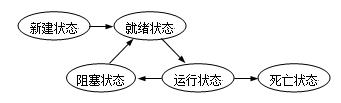
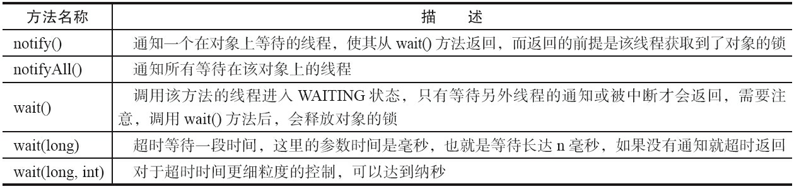

# 【线程】

相关面试总结：[https://www.cnblogs.com/tangjian07/p/10780692.html](https://www.cnblogs.com/tangjian07/p/10780692.html)

Java线程详解：[https://tuonioooo.gitbooks.io/java-concurrent/content/di-yi-7ae0-java-duo-xian-cheng-ji-chu.html](https://tuonioooo.gitbooks.io/java-concurrent/content/di-yi-7ae0-java-duo-xian-cheng-ji-chu.html)

**1.什么是线程？**

现代操作系统调度的最小单元是线程，也叫轻量级进程（LightWeight Process），在一个进程里可以创建多个线程，这些线程都拥有各自的计数器、堆栈和局部变量等属性，并且能够访问共享的内存变量。处理器在这些线程上高速切换，让使用者感觉到这些线程在同时执行

**2.为什么要使用多线程/线程使用的好处？**    
（1）更多的处理器核心

（2）更快的响应时间

（3）更好的编程模型

**3.线程的状态？**

初始状态、运行状态、阻塞状态、等待状态、超时等待状态、终止状态 ****



**4.启动线程、线程中断？**    
start\(\)方法启动线程、interrupt\(\)

**5.如何安全地终止线程？**    
在中断线程节中提到的中断状态是线程的一个标识位，而中断操作是一种简便的线程间交互方式，而这种交互方式最适合用来取消或停止任务。除了中断以外，还可以利用一个boolean变量来控制是否需要停止任务并终止该线程。在代码清单1所示的例子中，创建了一个线程CountThread，它不断地进行变量累加，而主线程尝试对其进行中断操作和停止操作

```text
package com.ise.api.thread;

import java.util.concurrent.TimeUnit;

public class Shutdown {
    public static void main(String[] args) throws Exception {
        Runner one = new Runner();
        Thread countThread = new Thread(one, "CountThread");
        countThread.start();
        // 睡眠1秒，main线程对CountThread进行中断，使CountThread能够感知中断而结束
        TimeUnit.SECONDS.sleep(1);
        countThread.interrupt();
        Runner two = new Runner();
        countThread = new Thread(two, "CountThread");
        countThread.start();
        // 睡眠1秒，main线程对Runner two进行取消，使CountThread能够感知on为false而结束
        TimeUnit.SECONDS.sleep(1);
        two.cancel();
    }

    private static class Runner implements Runnable {
        private long i;
        private volatile boolean on = true;

        @Override
        public void run() {
            while (on && !Thread.currentThread().isInterrupted()) {
                i++;
            }
            System.out.println("Count i = " + i);
        }

        public void cancel() {
            on = false;
        }
    }
}
```

**6.创建线程有哪几种方式？**    
创建线程有三种方式：

* * 继承

    Thread 重写 run 方法；

  * 实现

    Runnable 接口；

  * 实现

    Callable 接口。

  > 补充：说  
  > 一下 runnable 和 callable 有什么区别？  
  > runnable 没有返回值，callable 可以拿到有返回值， 可以在从线程执行的时候使用funture 来接收返回值！

**7.多线程环境下，局部变量和全局变量都会共享吗？**

局部变量不会受多线程影响

成员变量会受到多线程影响

多个线程调用的同一个对象的同一个方法：

* 如果方法里无成员变量，不受任何影响
* 如果方法里有成员变量，只有读操作，不受影响，存在赋值操作，有影响

**8.volatile、ThreadLocal、synchronized等3个关键字区别？**

* **volatile**

volatile主要是用来在多线程中同步变量。在一般情况下，为了提升性能，每个线程在运行时都会将主内存中的变量保存一份在自己的内存中作为变量副本，但是这样就很容易出现多个线程中保存的副本变量不一致，或与主内存的中的变量值不一致的情况。而当一个变量被volatile修饰后，该变量就不能被缓存到线程的内存中，它会告诉编译器不要进行任何移出读取和写入操作的优化，换句话说就是不允许有不同于“主”内存区域的变量拷贝，所以当该变量有变化时，所有调用该变量的线程都会获得相同的值，这就确保了该变量在应用中的可视性\(当一个任务做出了修改在应用中必须是可视的\)，同时性能也相应的降低了\(还是比synchronized高\)。_**但需要注意volatile只能确保操作的是同一块内存，并不能保证操作的原子性**_。所以volatile一般用于声明简单类型变量，使得这些变量具有原子性，即一些简单的赋值与返回操作将被确保不中断。但是当该变量的值由自身的上一个决定时，volatile的作用就将失效，这是由volatile关键字的性质所决定的。所以在volatile时一定要谨慎，千万不要以为用volatile修饰后该变量的所有操作都是原子操作，不再需要synchronized关键字了。+

* **ThreadLocal**

首先ThreadLocal和本地线程没有一毛钱关系，更不是一个特殊的Thread，它只是一个线程的局部变量\(其实就是一个Map\),ThreadLocal会为每个使用该变量的线程提供独立的变量副本，所以每一个线程都可以独立地改变自己的副本，而不会影响其它线程所对应的副本。这样做其实就是以空间换时间的方式\(与synchronized相反\)，以耗费内存为代价，单大大减少了线程同步\(如synchronized\)所带来性能消耗以及减少了线程并发控制的复杂度。但需要注意的是，虽然ThreadLocal和Synchonized都用于解决多线程并发访问，ThreadLocal与synchronized还是有本质的区别。synchronized是利用锁的机制，使变量或代码块在某一时该只能被一个线程访问。而ThreadLocal为每一个线程都提供了变量的副本，使得每个线程在某一时间访问到的并不是同一个对象，这样就隔离了多个线程对数据的数据共享。而Synchronized却正好相反，它用于在多个线程间通信时能够获得数据共享。即Synchronized用于线程间的数据共享，而ThreadLocal则用于线程间的数据隔离。所以ThreadLocal并不能代替synchronized，Synchronized的功能范围更广\(同步机制\)。

* **synchronized**

synchronized关键字是[Java](http://lib.csdn.net/base/17)利用锁的机制自动实现的，一般有同步方法和同步代码块两种使用方式。Java中所有的对象都自动含有单一的锁\(也称为监视器\)，当在对象上调用其任意的synchronized方法时，此对象被加锁\(一个任务可以多次获得对象的锁，计数会递增\)，同时在线程从该方法返回之前，该对象内其他所有要调用类中被标记为synchronized的方法的线程都会被阻塞。当然针对每个类也有一个锁\(作为类的Class对象的一部分\)，所以你懂的^.^。最后需要注意的是synchronized是同步机制中最安全的一种方式，其他的任何方式都是有风险的，当然付出的代价也是最大的

**9.Java线程等待和通知的相关方法?**    


**10.什么是连接池、线程池，各自的优点？**

* [**连接池**](https://tuonioooo.gitbooks.io/java-concurrent/content/di-yi-7ae0-java-duo-xian-cheng-ji-chu/shi-zhan-ying-yong/lian-jie-chi.html)
* [**线程池**](https://tuonioooo.gitbooks.io/java-concurrent/content/di-yi-7ae0-java-duo-xian-cheng-ji-chu/shi-zhan-ying-yong/xian-cheng-chi.html)

**11.常用的几种线程池创建方法？**

* **newCachedThreadPool\(\)**

缓存型池子，先查看池中有没有以前建立的线程，如果有，就 reuse 如果没有，就建一个新的线程加入池中

缓存型池子通常用于执行一些生存期很短的异步型任务 因此在一些面向连接的 daemon 型 SERVER 中用得不多。但对于生存期短的异步任务，它是 Executor 的首选。

能 reuse 的线程，必须是 timeout IDLE 内的池中线程，缺省 timeout 是 60s,超过这个 IDLE 时长，线程实例将被终止及移出池。

> 注意，放入 CachedThreadPool 的线程不必担心其结束，超过 TIMEOUT 不活动，其会自动被终止。
>
> 无界线程池，可以进行自动线程回收

* **newFixedThreadPool\(int\)**

newFixedThreadPool 与 cacheThreadPool 差不多，也是能 reuse 就用，但不能随时建新的线程。

其独特之处:任意时间点，最多只能有固定数目的活动线程存在，此时如果有新的线程要建立，只能放在另外的队列中等待，直到当前的线程中某个线程终止直接被移出池子。和 cacheThreadPool 不同，FixedThreadPool 没有 IDLE 机制（可能也有，但既然文档没提，肯定非常长，类似依赖上层的 TCP 或 UDP IDLE 机制之类的），所以 FixedThreadPool 多数针对一些很稳定很固定的正规并发线程，多用于服务器。

从方法的源代码看，cache池和fixed 池调用的是同一个底层 池，只不过参数不同:

* fixed 池线程数固定，并且是0秒IDLE（无IDLE）。
* cache 池线程数支持 0-Integer.MAX\_VALUE\(显然完全没考虑主机的资源承受能力），60 秒 IDLE 。

> **注意**：固定大小线程池

* **newScheduledThreadPool\(int\)**

调度型线程池，这个池子里的线程可以按 schedule 依次 delay 执行，或周期执行

* **newSingleThreadExecutor\(\)**

单例线程，任意时间池中只能有一个线程，用的是和 cache 池和 fixed 池相同的底层池，但线程数目是 1-1,0 秒 IDLE（无 IDLE）

一般来说，CachedTheadPool 在程序执行过程中通常会创建与所需数量相同的线程，然后在它回收旧线程时停止创建新线程，因此它是合理的 Executor 的首选，只有当这种方式会引发问题时（比如需要大量长时间面向连接的线程时），才需要考虑用 FixedThreadPool。（该段话摘自《Thinking in Java》第四版）+

**12.Future、FutureTask、CompletionService、CompletableFuture区别?**    
[https://www.cnblogs.com/dennyzhangdd/p/7010972.html](https://www.cnblogs.com/dennyzhangdd/p/7010972.html)

**13.HashMap实现原理?**    
[ **hashmap实现原理详解**](https://tuonioooo.gitbooks.io/java-concurrent/content/hashmapshi-xian-yuan-li.html)

**hashmap链表采用的是头插入方法**

**14.为什么要使用ConcurrentHashMap?**

[**参考答案**](https://tuonioooo.gitbooks.io/java-concurrent/content/concurrenthashmapde-shi-xian-yuan-li-yu-shi-yong/wei-shi-yao-yao-shi-yong-concurrenthashmap.html)

**15.你对线程优先级的理解是什么？**

每一个线程都是有优先级的，一般来说，高优先级的线程在运行时会具有优先权，但这依赖于线程调度的实现，这个实现是和操作系统相关的\(OS dependent\)。我们可以定义线程的优先级，但是这并不能保证高优先级的线程会在低优先级的线程前执行。线程优先级是一个int变量\(从1-10\)，1代表最低优先级，10代表最高优先级。

**16.什么是线程安全？Vector是一个线程安全类吗？**

如果你的代码所在的进程中有多个线程在同时运行，而这些线程可能会同时运行这段代码。如果每次运行结果和单线程运行的结果是一样的，而且其他的变量的值也和预期的是一样的，就是线程安全的。一个线程安全的计数器类的同一个实例对象在被多个线程使用的情况下也不会出现计算失误。很显然你可以将集合类分成两组，线程安全和非线程安全的。Vector 是用同步方法来实现线程安全的, 而和它相似的ArrayList不是线程安全的。

**17.Java中如何停止一个线程？**

Java提供了很丰富的API但没有为停止线程提供API。JDK 1.0本来有一些像stop\(\), suspend\(\) 和 resume\(\)的控制方法但是由于潜在的死锁威胁因此在后续的JDK版本中他们被弃用了，之后Java API的设计者就没有提供一个兼容且线程安全的方法来停止一个线程。当run\(\) 或者 call\(\) 方法执行完的时候线程会自动结束,如果要手动结束一个线程，你可以用volatile 布尔变量来退出run\(\)方法的循环或者是取消任务来中断线程

**18.什么是线程饿死，什么是活锁？**

当所有线程阻塞，或者由于需要的资源无效而不能处理，不存在非阻塞线程使资源可用。JavaAPI中线程活锁可能发生在以下情形：

1，当所有线程在程序中执行Object.wait\(0\)，参数为0的wait方法。程序将发生活锁直到在相应的对象上有线程调用Object.notify\(\)或者Object.notifyAll\(\)。

2，当所有线程卡在无限循环中。

**19.什么是Java Timer类？如何创建一个有特定时间间隔的任务？**

java.util.Timer是一个工具类，可以用于安排一个线程在未来的某个特定时间执行。Timer类可以用安排一次性任务或者周期任务。

java.util.TimerTask是一个实现了Runnable接口的抽象类，我们需要去继承这个类来创建我们自己的定时任务并使用Timer去安排它的执行

**20.Java中的同步集合与并发集合有什么区别？**

同步集合与并发集合都为多线程和并发提供了合适的线程安全的集合，不过并发集合的可扩展性更高。在Java1.5之前程序员们只有同步集合来用且在多线程并发的时候会导致争用，阻碍了系统的扩展性。Java5介绍了并发集合像ConcurrentHashMap，不仅提供线程安全还用锁分离和内部分区等现代技术提高了可扩展性。

不管是同步集合还是并发集合他们都支持线程安全，他们之间主要的区别体现在性能和可扩展性，还有他们如何实现的线程安全上。

同步HashMap, Hashtable, HashSet, Vector, ArrayList 相比他们并发的实现（ConcurrentHashMap, CopyOnWriteArrayList, CopyOnWriteHashSet）会慢得多。造成如此慢的主要原因是锁， 同步集合会把整个Map或List锁起来，而并发集合不会。并发集合实现线程安全是通过使用先进的和成熟的技术像锁剥离。

比如ConcurrentHashMap 会把整个Map 划分成几个片段，只对相关的几个片段上锁，同时允许多线程访问其他未上锁的片段。

同样的，CopyOnWriteArrayList 允许多个线程以非同步的方式读，当有线程写的时候它会将整个List复制一个副本给它。

如果在读多写少这种对并发集合有利的条件下使用并发集合，这会比使用同步集合更具有可伸缩性。

**21.同步方法和同步块，哪个是更好的选择？**

1.同步方法： 即有synchronized \(同步，美 \['sɪŋkrənaɪzd\] \) 修饰符修饰的方法。 由于java的每个对象都有一个内置锁，当用此关键字修饰方法时，内置锁会保护整个方法。在调用给方法前，要获取内置锁，否则处于阻塞状态。 例：public synchronized getMoney\(\){} 注：synchronized修饰静态方法，如果调用该静态方法，将锁住整个类。

2.同步代码块 即有synchronized修饰符修饰的语句块，被该关键词修饰的语句块，将加上内置锁。实现同步。 例：synchronized\(Object o \){}

> 总结：
>
> 1）同步块是更好的选择，因为它不会锁住整个对象（当然你也可以让它锁住整个对象）。同步方法会锁住整个对象，哪怕这个类中有多个不相关联的同步块，这通常会导致他们停止执行并需要等待获得这个对象上的锁。
>
> 2）同步是高开销的操作，因此尽量减少同步的内容。通常没有必要同步整个方法，同步部分代码块即可。 同步方法默认用this或者当前类class对象作为锁。 同步代码块可以选择以什么来加锁，比同步方法要更颗粒化，我们可以选择只同步会发生问题的部分代码而不是整个方法。

**22.Java中invokeAndWait 和 invokeLater有什么区别？**

这两个方法是Swing API 提供给Java开发者用来从当前线程而不是事件派发线程更新GUI组件用的。InvokeAndWait\(\)同步更新GUI组件，比如一个进度条，一旦进度更新了，进度条也要做出相应改变。如果进度被多个线程跟踪，那么就调用invokeAndWait\(\)方法请求事件派发线程对组件进行相应更新。而invokeLater\(\)方法是异步调用更新组件的。

**23.多线程中的忙循环是什么?**

忙循环就是程序员用循环让一个线程等待，不像传统方法wait\(\), sleep\(\) 或 yield\(\) 它们都放弃了CPU控制，而忙循环不会放弃CPU，它就是在运行一个空循环。这么做的目的是为了保留CPU缓存。

在多核系统中，一个等待线程醒来的时候可能会在另一个内核运行，这样会重建缓存。为了避免重建缓存和减少等待重建的时间就可以使用它了。

**24.Java中interrupted 和isInterruptedd方法的区别？**

interrupted\(\) 和 isInterrupted\(\)的主要区别是前者会将中断状态清除而后者不会。Java多线程的中断机制是用内部标识来实现的，调用Thread.interrupt\(\)来中断一个线程就会设置中断标识为true。当中断线程调用静态方法Thread.interrupted\(\)来检查中断状态时，中断状态会被清零。

非静态方法isInterrupted\(\)用来查询其它线程的中断状态且不会改变中断状态标识。简单的说就是任何抛出InterruptedException异常的方法都会将中断状态清零。无论如何，一个线程的中断状态都有可能被其它线程调用中断来改变。

**25.Java中活锁和死锁有什么区别？**

活锁：一个线程通常会有会响应其他线程的活动。如果其他线程也会响应另一个线程的活动，那么就有可能发生活锁。同死锁一样，发生活锁的线程无法继续执行。然而线程并没有阻塞——他们在忙于响应对方无法恢复工作。这就相当于两个在走廊相遇的人：甲向他自己的左边靠想让乙过去，而乙向他的右边靠想让甲过去。可见他们阻塞了对方。甲向他的右边靠，而乙向他的左边靠，他们还是阻塞了对方。

死锁：两个或更多线程阻塞着等待其它处于死锁状态的线程所持有的锁。死锁通常发生在多个线程同时但以不同的顺序请求同一组锁的时候，死锁会让你的程序挂起无法完成任务。

**26.如何避免死锁？**

死锁的发生必须满足以下四个条件：

* 互斥条件：一个资源每次只能被一个进程使用。
* 请求与保持条件：一个进程因请求资源而阻塞时，对已获得的资源保持不放。
* 不剥夺条件：进程已获得的资源，在末使用完之前，不能强行剥夺。
* 循环等待条件：若干进程之间形成一种头尾相接的循环等待资源关系。

两种种用于避免死锁的技术：

* 加锁顺序（线程按照一定的顺序加锁）
* 加锁时限（线程尝试获取锁的时候加上一定的时限，超过时限则放弃对该锁的请求，并释放自己占有的锁）

**27.notify\(\)和notifyAll\(\)有什么区别？**

* notify\(\)和notifyAll\(\)都是Object对象用于通知处在等待该对象的线程的方法。
* void notify\(\): 唤醒一个正在等待该对象的线程。
* void notifyAll\(\): 唤醒所有正在等待该对象的线程。

  两者的最大区别在于：

  notifyAll使所有原来在该对象上等待被notify的线程统统退出wait的状态，变成等待该对象上的锁，一旦该对象被解锁，他们就会去竞争。

  notify他只是选择一个wait状态线程进行通知，并使它获得该对象上的锁，但不惊动其他同样在等待被该对象notify的线程们，当第一个线程运行完毕以后释放对象上的锁，此时如果该对象没有再次使用notify语句，即便该对象已经空闲，其他wait状态等待的线程由于没有得到该对象的通知，继续处在wait状态，直到这个对象发出一个notify或notifyAll，它们等待的是被notify或notifyAll，而不是锁。

**28.什么是可重入锁（ReentrantLock）？**

Java.util.concurrent.lock 中的 Lock 框架是锁定的一个抽象，它允许把锁定的实现作为Java 类，而不是作为语言的特性来实现。这就为Lock 的多种实现留下了空间，各种实现可能有不同的调度算法、性能特性或者锁定语义。 ReentrantLock 类实现了Lock ，它拥有与synchronized 相同的并发性和内存语义，但是添加了类似锁投票、定时锁等候和可中断锁等候的一些特性。此外，它还提供了在激烈争用情况下更佳的性能。（换句话说，当许多线程都想访问共享资源时，JVM可以花更少的时候来调度线程，把更多时间用在执行线程上。）

Reentrant 锁意味着什么呢？简单来说，它有一个与锁相关的获取计数器，如果拥有锁的某个线程再次得到锁，那么获取计数器就加1，然后锁需要被释放两次才能获得真正释放。这模仿了synchronized 的语义；如果线程进入由线程已经拥有的监控器保护的synchronized 块，就允许线程继续进行，当线程退出第二个（或者后续）synchronized块的时候，不释放锁，只有线程退出它进入的监控器保护的第一个synchronized 块时，才释放锁

> ReentrantLock类中有很多的方法：
>
> * getHoldCount\(\)：当前线程调用 lock\(\) 方法的次数
> * getQueueLength\(\)：当前正在等待获取 Lock 锁的线程的估计数
> * getWaitQueueLength\(Condition condition\)：当前正在等待状态的线程的估计数，需要传入 Condition 对象
> * hasWaiters\(Condition condition\)：查询是否有线程正在等待与 Lock 锁有关的 Condition 条件
> * hasQueuedThread\(Thread thread\)：查询指定的线程是否正在等待获取 Lock 锁
> * hasQueuedThreads\(\)：查询是否有线程正在等待获取此锁定
> * isFair\(\)：判断当前 Lock 锁是不是公平锁
> * isHeldByCurrentThread\(\)：查询当前线程是否保持此锁定
> * isLocked\(\)：查询此锁定是否由任意线程保持
> * tryLock\(\)：线程尝试获取锁，如果获取成功，则返回 true，如果获取失败（即锁已被其他线程获取），则返回 false
> * tryLock\(long timeout，TimeUnit unit\)：线程如果在指定等待时间内获得了锁，就返回true，否则返回 false
> * lockInterruptibly\(\)：如果当前线程未被中断，则获取该锁定，如果已经被中断则出现异常

**29.读写锁可以用于什么应用场景？**

读写锁可以用于 “多读少写” 的场景，读写锁支持多个读操作并发执行，写操作只能由一个线程来操作

ReadWriteLock对向数据结构相对不频繁地写入，但是有多个任务要经常读取这个数据结构的这类情况进行了优化。ReadWriteLock使得你可以同时有多个读取者，只要它们都不试图写入即可。如果写锁已经被其他任务持有，那么任何读取者都不能访问，直至这个写锁被释放为止。

ReadWriteLock 对程序性能的提高主要受制于如下几个因素：

1，数据被读取的频率与被修改的频率相比较的结果。

2，读取和写入的时间

3，有多少线程竞争

4，是否在多处理机器上运行

**30.守护线程是什么？**

守护线程是运行在后台的一种特殊进程。它独立于控制终端并且周期性地执行某种任务或等待处理某些发生的事件。在Java 中垃圾回收线程就是特殊的守护线程。

**31.并行和并发有什么区别？**

* 并行：多个处理器或多核处理器同时处理多个任务。（是真正的物理上的同时发生）
* 并发：多个任务在同一个

  CPU 核上，按细分的时间片轮流\(交替\)执行，从逻辑上来看那些任务是同时执行。（逻辑上的同时发生）

举个例子：排队打饭，当只有一个窗口可以打饭的时候，我们排成了两排，那么这两排只能一边一个来，这就是并发；  
如果有两个窗口可以打饭的话，一个队一个窗口，那么这两排可以同时进行打饭，这就是并行了。

**32.sleep\(\) 和 wait\(\) 有什么区别？**

* 类的不同：

  sleep\(\) 来自 Thread，wait\(\) 来自 Object。

* 释放锁：

  sleep\(\) 不释放锁；wait\(\) 释放锁。

* 用法不同：

  sleep\(\) 时间到会自动恢复；wait\(\) 可以使用 notify\(\)/notifyAll\(\)直接唤醒。

**33.线程的 run\(\) 和 start\(\) 有什么区别？**

start\(\) 方法用于启动线程，run\(\) 方法用于执行线程的运行时代码。run\(\) 可以重复调用，而 start\(\) 只能调用一次。

**34**.**创建线程池有哪几种方式？**

线程池创建有七种方式，最核心的是最后一种：

* newSingleThreadExecutor\(\)：它的特点在于工作线程数目被限制为 1，操作一个无界的工作队列，所以它保证了所有任务的都是被顺序执行，最多会有一个任务处于活动状态，并且不允许使用者改动线程池实例，因此可以避免其改变线程数目；
* newCachedThreadPool\(\)：它是一种用来处理大量短时间工作任务的线程池，具有几个鲜明特点：它会试图缓存线程并重用，当无缓存线程可用时，就会创建新的工作线程；如果线程闲置的时间超过 60 秒，则被终止并移出缓存；长时间闲置时，这种线程池，不会消耗什么资源。其内部使用 SynchronousQueue 作为工作队列；
* newFixedThreadPool\(int nThreads\)：重用指定数目（nThreads）的线程，其背后使用的是无界的工作队列，任何时候最多有 nThreads 个工作线程是活动的。这意味着，如果任务数量超过了活动队列数目，将在工作队列中等待空闲线程出现；如果有工作线程退出，将会有新的工作线程被创建，以补足指定的数目 nThreads；
* newSingleThreadScheduledExecutor\(\)：创建单线程池，返回 ScheduledExecutorService，可以进行定时或周期性的工作调度；
* newScheduledThreadPool\(int corePoolSize\)：和newSingleThreadScheduledExecutor\(\)类似，创建的是个 ScheduledExecutorService，可以进行定时或周期性的工作调度，区别在于单一工作线程还是多个工作线程；
* newWorkStealingPool\(int parallelism\)：这是一个经常被人忽略的线程池，Java 8 才加入这个创建方法，其内部会构建ForkJoinPool，利用Work-Stealing算法，并行地处理任务，不保证处理顺序；
* ThreadPoolExecutor\(\)：是最原始的线程池创建，上面1-3创建方式都是对ThreadPoolExecutor的封装。

**35.线程池都有哪些状态？**

* RUNNING：这是最正常的状态，接受新的任务，处理等待队列中的任务。
* SHUTDOWN：不接受新的任务提交，但是会继续处理等待队列中的任务。
* STOP：不接受新的任务提交，不再处理等待队列中的任务，中断正在执行任务的线程。
* TIDYING：所有的任务都销毁了，workCount 为 0，线程池的状态在转换为 TIDYING 状态时，会执行钩子方法 terminated\(\)。
* TERMINATED：terminated\(\)方法结束后，线程池的状态就会变成这个。

**36.线程池中 submit\(\) 和 execute\(\) 方法有什么区别？**

* execute\(\)：只能执行 Runnable 类型的任务。
* submit\(\)：可以执行 Runnable 和 Callable 类型的任务。

Callable 类型的任务可以获取执行的返回值，而 Runnable 执行无返回值。

**37.在 Java 程序中怎么保证多线程的运行安全？**

* 方法一：使用安全类，比如Java. util. concurrent 下的类。
* 方法二：使用自动锁synchronized。
* 方法三：使用手动锁Lock。

**38.什么是死锁？引起死锁的原因是什什么？**

由于多个进程竞争共享资源⽽而引起的进程不不能向前推进的僵死状态称为死锁。

引起死锁的原因竞争共享资源且分配资源的顺序不不当。

**39.怎么防止死锁？**

* 尽量使用

  tryLock\(long timeout, TimeUnit unit\)的方法\(ReentrantLock、ReentrantReadWriteLock\)，设置超时时间，超时可以退出防止死锁。

* 尽量使用

  Java. util. concurrent 并发类代替自己手写锁。

* 尽量降低锁的使用粒度，尽量不要几个功能用同一把锁。
* 尽量减少同步的代码块。

40.**ThreadLocal 是什么？有哪些使用场景？**

ThreadLocal 为每个使用该变量的线程提供独立的变量副本，所以每一个线程都可以独立地改变自己的副本，而不会影响其它线程所对应的副本。

ThreadLocal 的经典使用场景是数据库连接和 session 管理等。

**41**.**synchronized 和 volatile 的区别是什么？**

* volatile 是变量修饰符；synchronized 是修饰类、方法、代码段。
* volatile 仅能实现变量的修改可见性，不能保证原子性；而 synchronized 则可以保证变量的修改可见性和原子性。
* volatile 不会造成线程的阻塞；synchronized 可能会造成线程的阻塞。
* volatile 标记的变量不会被编译器优化；synchronized 标记的变量可以被编译器优化

**42. synchronized 和 Lock 有什么区别？**

* synchronized 可以给类、方法、代码块加锁；而 lock 只能给代码块加锁。
* synchronized 不需要手动获取锁和释放锁，使用简单，发生异常会自动释放锁，不会造成死锁；而 lock 需要自己加锁和释放锁，如果使用不当没有 unLock\(\)去释放锁就会造成死锁。
* 通过

  Lock 可以知道有没有成功获取锁，而 synchronized 却无法办到。

**43. synchronized 和 ReentrantLock 区别是什么？**

synchronized 早期的实现比较低效，对比 ReentrantLock，大多数场景性能都相差较大，但是在 Java 6 中对 synchronized 进行了非常多的改进。

主要区别如下：

* * ReentrantLock 使用起来比较灵活，但是必须有释放锁的配合动作；
  * ReentrantLock 必须手动获取与释放锁，而 synchronized 不需要手动释放和开启锁；
  * ReentrantLock 只适用于代码块锁，而 synchronized 可用于修饰方法、代码块等。

**44. 说一下 atomic 的原理**

atomic 主要利用 CAS \(Compare And Swap\) 和 volatile 和 native 方法来保证原子操作，从而避免 synchronized 的高开销，执行效率大为提升。

**45.为什么HashTable, ConcurrentHashMap 的 key和value 不能为null（并发角度分析\)**

ConcurrentHashmap和Hashtable都是支持并发的，二者规定key，value均不能为null，null的话，会抛出空指针异常。

为什么要这么设计？

当通过get\(k\)获取对应的value时，如果获取到的是null时，无法判断，它是put（k,v）的时候value为null，还是这个key从来没有做过映射。假如线程1调用m.contains（key）返回true，然后在调用m.get\(key\)，这时的m可能已经不同了。因为线程2可能在线程1调用m.contains（key）时，删除了key节点，这样就会导致线程1得到的结果不明确，产生多线程安全问题，因此，**HashTable**和ConcurrentHashMap的key和value不能为null。

HashMap允许key和value为null，在单线程时，调用contains\(\)和get\(\)不会出现问题，但是多线程下，就是线程不安全的。如果要保证线程安全，应该使用ConcurrentHashMap 。

**46.什么是CopyOnWriteArrayList**

* 实现了List接口
* 内部持有一个ReentrantLock lock = new ReentrantLock\(\);
* 底层是用volatile transient声明的数组 array
* 读写分离，写时复制出一个新的数组，完成插入、修改或者移除操作后将新数组赋值给array

增删改都需要获得锁，并且锁只有一把，而读操作不需要获得锁，支持并发。为什么增删改中都需要创建一个新的数组，操作完成之后再赋给原来的引用？这是为了保证get的时候都能获取到元素，如果在增删改过程直接修改原来的数组，可能会造成执行读操作获取不到数据

> ## CopyOnWriteArrayList为什么并发安全且性能比Vector好
>
> 我知道Vector是增删改查方法都加了synchronized，保证同步，但是每个方法执行的时候都要去获得锁，性能就会大大下降，而CopyOnWriteArrayList 只是在增删改上加锁，但是读不加锁，在读方面的性能就好于Vector，CopyOnWriteArrayList支持读多写少的并发情况。

参考：[https://www.jianshu.com/p/c046b7f31228](https://www.jianshu.com/p/c046b7f31228)

#### 47. wait 和 sleep 的区别

1. sleep 来自 Thread 类，和 wait 来自 Object 类。 
2. 最主要是sleep方法没有释放锁，而wait方法释放了 锁，使得其他线程可以使用同步控制块或者方法。
3.  wait，notify和 notifyAll 只能在同步控制方法或者同步控制块里面使用，而 sleep 可以在任何地方使用\(使 用范围\) 
4.  sleep 必须捕获异常，而 wait ， notify 和 notifyAll 不需要捕获异常\(1\) sleep 方法属于 Thread 类中方法，表示让一个线程进入睡眠状态，等待一定的时间之后，自动醒来进入到可 运行状态，不会马上进入运行状态，因为线程调度机制恢复线程的运行也需要时间，一个线程对象调用了 sleep 方法之后，并不会释放他所持有的所有对象锁，所以也就不会影响其他进程对象的运行。但在 sleep 的过程中过 程中有可能被其他对象调用它的 interrupt\(\) ,产生 InterruptedException 异常，如果你的程序不捕获这个异 常，线程就会异常终止，进入 TERMINATED 状态，如果你的程序捕获了这个异常，那么程序就会继续执行catch语 句块\(可能还有 finally 语句块\)以及以后的代码。 注意 sleep\(\) 方法是一个静态方法，也就是说他只对当前对象有效，通过 t.sleep\(\) 让t对象进入 sleep ，这样 的做法是错误的，它只会是使当前线程被 sleep 而不是 t 线程 \(2\) wait 属于 Object 的成员方法，一旦一个对象调用了wait方法，必须要采用 notify\(\) 和 notifyAll\(\) 方法 唤醒该进程;如果线程拥有某个或某些对象的同步锁，那么在调用了 wait\(\) 后，这个线程就会释放它持有的所有 同步资源，而不限于这个被调用了 wait\(\) 方法的对象。 wait\(\) 方法也同样会在 wait 的过程中有可能被其他对 象调用 interrupt\(\) 方法而产生 。

#### 48.为 什 么 说 Synchronized 是 非 公 平 锁 ？ 

非 公 平 主 要 表 现 在 获 取 锁 的 行 为 上 ， 并 非 是 按 照 申 请 锁 的 时 间 前 后 给 等 待 线 程 分 配 锁 的 ， 每 当 锁 被 释 放 后 ， 任 何 一 个 线 程 都 有 机 会 竞 争 到 锁 ， 这 样 做 的 目 的 是 为 了 提 高 执 行 性 能 ， 缺 点 是 可 能 会 产 生 线 程 饥 饿 现 象 。

#### 49. 什 么 是 锁 消 除 和 锁 粗 化 ？

* 锁 消 除 ： 指 虚 拟 机 即 时 编 译 器 在 运 行 时 ， 对 一 些 代 码 上 要 求 同 步 ， 但 被 检 测 到 不 可 能 存 在 共 享 数 据 竞 争 的 锁 进 行 消 除 。 主 要 根 据 逃 逸 分 析 。 程 序 员 怎 么 会 在 明 知 道 不 存 在 数 据 竞 争 的 情 况 下 使 用 同 步 呢 ？ 很 多 不 是 程 序 员 自 己 加 入 的
* 锁 粗 化 ： 原 则 上 ， 同 步 块 的 作 用 范 围 要 尽 量 小 。 但 是 如 果 一 系 列 的 连 续 操 作 都 对 同 一 个 对 象 反 复 加 锁 和 解 锁 ， 甚 至 加 锁 操 作 在 循 环 体 内 ， 频 繁 地 进 行 互 斥 同 步 操 作 也 会 导 致 不 必 要 的 性 能 损 耗 。 锁 粗 化 就 是 增 大 锁 的 作 用 域 。

#### 50. Synchronized 用 过 吗 ， 其 原 理 是 什 么 ？

Synchronized 是 由 JVM 实 现 的 一 种 实 现 互 斥 同 步 的 一 种 方 式 ， 如 果 你 查 看 被 Synchronized 修 饰 过 的 程 序 块 编 译 后 的 字 节 码 ， 会 发 现 ， 被 Synchronized 修 饰 过 的 程 序 块 ， 在 编 译 前 后 被 编 译 器 生 成 了 monitorenter 和 monitorexit 两 个 字 节 码 指 令 。

#### 51.  monitorenter 和 monitorexit这 两 个 指 令 是 什 么 意 思 呢 ？ 

在 虚 拟 机 执 行 到 monitorenter 指 令 时 ， 首 先 要 尝 试 获 取 对 象 的 锁 ： 如 果 这 个 对 象 没 有 锁 定 ， 或 者 当 前 线 程 已 经 拥 有 了 这 个 对 象 的 锁 ， 把 锁 的 计 数 器 +1； 当 执 行 monitorexit 指 令 时 将 锁 计 数 器 -1； 当 计 数 器 为 0 时 ， 锁 就 被 释 放 了 。 如 果 获 取 对 象 失 败 了 ， 那 当 前 线 程 就 要 阻 塞 等 待 ， 直 到 对 象 锁 被 另 外 一 个 线 程 释 放 为 止 。 Java 中 Synchronize 通 过 在 对 象 头 设 置 标 记 ， 达 到 了 获 取 锁 和 释 放 锁 的 目 的

#### 52. 你 刚 才 提 到 获 取 对 象 的 锁 ， 这 个 “ 锁 ” 到 底 是 什 么 ？ 如 何 确 定 对 象 的 锁 ？

“ 锁 ” 的 本 质 其 实 是 monitorenter 和 monitorexit 字 节 码 指 令 的 一 个 Reference 类 型 的 参 数 ， 即 要 锁 定 和 解 锁 的 对 象 。 我 们 知 道 ， 使 用Synchronized 可 以 修 饰 不 同 的 对 象 ， 因 此 ， 对 应 的 对 象 锁 可 以 这 么 确 定 。 1. 如 果 Synchronized 明 确 指 定 了 锁 对 象 ， 比 如 Synchronized（ 变 量 名 ） 、 Synchronized\(this\) 等 ， 说 明 加 解 锁 对 象 为 该 对 象 。 2. 如 果 没 有 明 确 指 定 ： 若 Synchronized 修 饰 的 方 法 为 非 静 态 方 法 ， 表 示 此 方 法 对 应 的 对 象 为 锁 对 象 ； 若 Synchronized 修 饰 的 方 法 为 静 态 方 法 ， 则 表 示 此 方 法 对 应 的 类 对 象 为 锁 对 象 。 注 意 ， 当 一 个 对 象 被 锁 住 时 ， 对 象 里 面 所 有 用 Synchronized 修 饰 的 方 法 都 将 产 生 堵 塞 ， 而 对 象 里 非 Synchronized 修 饰 的 方 法 可 正 常 被 调 用 ， 不 受 锁 影 响 。

#### 53. 什 么 是 可 重 入 性 ， 为 什 么 说 Synchronized 是 可 重 入 锁 ？

可 重 入 性 是 锁 的 一 个 基 本 要 求 ， 是 为 了 解 决 自 己 锁 死 自 己 的 情 况 。 比 如 下 面 的 伪 代 码 ， 一 个 类 中 的 同 步 方 法 调 用 另 一 个 同 步 方 法 ， 假 如 Synchronized 不 支 持 重 入 ， 进 入 method2 方 法 时 当 前 线 程 获 得 锁 ， method2 方 法 里 面 执 行 method1 时 当 前 线 程 又 要 去 尝 试 获 取 锁 ， 这 时 如 果 不 支 持 重 入 ， 它 就 要 等 释 放 ， 把 自 己 阻 塞 ， 导 致 自 己 锁 死 自 己 。 · 点 击 图 片 ， 放 大 查 看 · 对 Synchronized 来 说 ， 可 重 入 性 是 显 而 易 见 的 ， 刚 才 提 到 ， 在 执 行 monitorenter 指 令 时 ， 如 果 这 个 对 象 没 有 锁 定 ， 或 者 当 前 线 程 已 经 拥有 了 这 个 对 象 的 锁 （ 而 不 是 已 拥 有 了 锁 则 不 能 继 续 获 取 ） ， 就 把 锁 的 计 数 器 +1， 其 实 本 质 上 就 通 过 这 种 方 式 实 现 了 可 重 入 性 。

#### 54. JVM 对 Java 的 原 生 锁 做 了 哪 些 优 化 ？

在 Java 6 之 前 ， Monitor 的 实 现 完 全 依 赖 底 层 操 作 系 统 的 互 斥 锁 来 实 现 ， 也 就 是 我 们 刚 才 在 问 题 二 中 所 阐 述 的 获 取 /释 放 锁 的 逻 辑 。 由 于 Java 层 面 的 线 程 与 操 作 系 统 的 原 生 线 程 有 映 射 关 系 ， 如 果 要 将 一 个 线 程 进 行 阻 塞 或 唤 起 都 需 要 操 作 系 统 的 协 助 ， 这 就 需 要 从 用 户 态 切 换 到 内 核 态 来 执 行 ， 这 种 切 换 代 价 十 分 昂 贵 ， 很 耗 处 理 器 时 间 ， 现 代 JDK 中 做 了 大 量 的 优 化 。 一 种 优 化 是 使 用 **自 旋 锁** ， 即 在 把 线 程 进 行 阻 塞 操 作 之 前 先 让 线 程 自 旋 等 待 一 段 时 间 ， 可 能 在 等 待 期 间 其 他 线 程 已 经 解 锁 ， 这 时 就 无 需 再 让 线 程 执 行 阻 塞 操 作 ， 避 免 了 用 户 态 到 内 核 态 的 切 换 。 现 代 JDK 中 还 提 供 了 三 种 不 同 的 Monitor 实 现 ， 也 就 是 三 种 不 同 的 锁 ：

* 偏 向 锁 （ Biased Locking） 
* 轻 量 级 锁 
* 重 量 级 锁 这 三 种 锁 使 得 JDK 得 以 优 化 Synchronized 的 运 行 ， 当 JVM 检 测 到 不 同 的 竞 争 状 况 时 ， 会 自 动 切 换 到 适 合 的 锁 实 现 ， 这 就 是 锁 的 升 级 、 降 级 。 
* 当 没 有 竞 争 出 现 时 ， 默 认 会 使 用 偏 向 锁 。

#### 55.为 什 么 说 Synchronized 是 一 个 悲 观 锁 ？ 乐 观 锁 的 实 现 原 理 又 是 什 么 ？ 什 么 是 CAS， 它 有 什 么 特 性 ？

Synchronized 显 然 是 一 个 悲 观 锁 ， 因 为 它 的 并 发 策 略 是 悲 观 的 ： 不 管 是 否 会 产 生 竞 争 ， 任 何 的 数 据 操 作 都 必 须 要 加 锁 、 用 户 态 核 心 态 转 换 、 维 护 锁 计 数 器 和 检 查 是 否 有 被 阻 塞 的 线 程 需 要 被 唤 醒 等 操 作 。 随 着 硬 件 指 令 集 的 发 展 ， 我 们 可 以 使 用 基 于 冲 突 检 测 的 乐 观 并 发 策 略 。 先 进 行 操 作 ， 如 果 没 有 其 他 线 程 征 用 数 据 ， 那 操 作 就 成 功 了 ； 如 果 共 享 数 据 有 征 用 ， 产 生 了 冲 突 ， 那 就 再 进 行 其 他 的 补 偿 措 施 。 这 种 乐 观 的 并 发 策 略 的 许 多 实 现 不 需 要 线 程 挂 起 ， 所 以 被 称 为 非 阻 塞 同 步 。 乐 观 锁 的 核 心 算 法 是 CAS（ Compare and Swap， 比 较 并 交 换 ） ， 它 涉 及 到 三 个 操 作 数 ： 内 存 值 、 预 期 值 、 新 值 。 当 且 仅 当 预 期 值 和 内 存 值 相 等 时 才 将 内 存 值 修 改 为 新 值 。 这 样 处 理 的 逻 辑 是 ， 首 先 检 查 某 块 内 存 的 值 是 否 跟 之 前 我 读 取 时 的 一 样 ， 如 不 一 样 则 表 示 期 间 此 内 存 值 已 经 被 别 的 线 程 更 改 过 ， 舍 弃 本 次 操 作 ， 否 则 说 明 期 间 没 有 其 他 线 程 对 此 内 存 值 操 作 ， 可 以 把 新 值 设 置 给 此 块 内 存 。 CAS 具 有 原 子 性 ， 它 的 原 子 性 由 CPU 硬 件 指 令 实 现 保 证 ， 即 使 用 JNI 调 用 Native 方 法 调 用 由 C++ 编 写 的 硬 件 级 别 指 令 ， JDK 中 提 供 了 Unsafe 类 执 行 这 些 操 作 。

#### 56. 乐 观 锁 一 定 就 是 好 的 吗 ？

乐 观 锁 避 免 了 悲 观 锁 独 占 对 象 的 现 象 ， 同 时 也 提 高 了 并 发 性 能 ， 但 它 也 有 缺 点

1. 乐 观 锁 只 能 保 证 一 个 共 享 变 量 的 原 子 操 作 。 如 果 多 一 个 或 几 个 变 量 ， 乐 观 锁 将 变 得 力 不 从 心 ， 但 互 斥 锁 能 轻 易 解 决 ， 不 管 对 象 数 量 多 少 及 对 象 颗 粒 度 大 小 。
2. 长 时 间 自 旋 可 能 导 致 开 销 大 。 假 如 CAS 长 时 间 不 成 功 而 一 直 自 旋 ， 会 给 CPU 带 来 很 大 的 开 销 。 \(**自旋锁不放弃CPU的使用权**\)
3. ABA 问 题 。 CAS 的 核 心 思 想 是 通 过 比 对 内 存 值 与 预 期 值 是 否 一 样 而 判 断 内 存 值 是 否 被 改 过 ， 但 这 个 判 断 逻 辑 不 严 谨 ， 假 如 内 存 值 原 来 是 A， 后 来 被 一 条 线 程 改 为 B， 最 后 又 被 改 成 了 A， 则 CAS 认 为 此 内 存 值 并 没 有 发 生 改 变 ， 但 实 际 上 是 有 被 其 他 线 程 改 过 的 ， 这 种 情 况 对 依 赖 过 程 值 的 情 景 的 运 算 结 果 影 响 很 大 。 解 决 的 思 路 是 引 入 版 本 号 ， 每 次 变 量 更 新 都 把 版 本 号 加 一 。

#### 57. 那 么 请 谈 谈 AQS 框 架 是 怎 么 回 事 儿 ？

AQS（ AbstractQueuedSynchronizer 类 ） 是 一 个 用 来 构 建 锁 和 同 步 器 的 框 架 ， 各 种 Lock 包 中 的 锁 （ 常 用 的 有 ReentrantLock、 ReadWriteLock） ， 以 及 其 他 如 Semaphore、 CountDownLatch， 甚 至 是 早 期 的 FutureTask 等 ， 都 是 基 于 AQS 来 构 建 。

1. AQS 在 内 部 定 义 了 一 个 volatile int state 变 量 ， 表 示 同 步 状 态 ： 当 线

   程 调 用 lock 方 法 时 ， 如 果 state=0， 说 明 没 有 任 何 线 程 占 有 共 享 资 源

   的 锁 ， 可 以 获 得 锁 并 将 state=1； 如 果 state=1， 则 说 明 有 线 程 目 前 正 在

   使 用 共 享 变 量 ， 其 他 线 程 必 须 加 入 同 步 队 列 进 行 等 待

2. AQS 通 过 Node 内 部 类 构 成 的 一 个 双 向 链 表 结 构 的 同 步 队 列 ， 来 完 成 线 程 获 取 锁 的 排 队 工 作 ， 当 有 线 程 获 取 锁 失 败 后 ， 就 被 添 加 到 队 列 末 尾 。1\) Node 类 是 对 要 访 问 同 步 代 码 的 线 程 的 封 装 ， 包 含 了 线 程 本 身 及 其 状 态 叫 waitStatus（ 有 五 种 不 同 取 值 ， 分 别 表 示 是 否 被 阻 塞 ， 是 否 等 待 唤 醒 ， 是 否 已 经 被 取 消 等 ） ， 每 个 Node 结 点 关 联 其 prev 结 点 和 next 结 点 ， 方 便 线 程 释 放 锁 后 快 速 唤 醒 下 一 个 在 等 待 的 线 程 ， 是 一 个 FIFO 的 过 程 。 2\) Node 类 有 两 个 常 量 ， SHARED 和 EXCLUSIVE， 分 别 代 表 共 享 模 式 和 独 占 模 式 。 所 谓 共 享 模 式 是 一 个 锁 允 许 多 条 线 程 同 时 操 作 （ 信 号 量 Semaphore 就 是 基 于 AQS 的 共 享 模 式 实 现 的 ） ， 独 占 模 式 是 同 一 个 时 间 段 只 能 有 一 个 线 程 对 共 享 资 源 进 行 操 作 ， 多 余 的 请 求 线 程 需 要 排 队 等 待 （ 如 ReentranLock） 。
3. AQS 通 过 内 部 类 ConditionObject 构 建 等 待 队 列 （ 可 有 多 个 ） ， 当

   Condition 调 用 wait\(\) 方 法 后 ， 线 程 将 会 加 入 等 待 队 列 中 ， 而 当Condition 调 用 signal\(\) 方 法 后 ， 线 程 将 从 等 待 队 列 转 移 动 同 步 队 列 中 进 行 锁 竞 争 。

4. AQS 和 Condition 各 自 维 护 了 不 同 的 队 列 ， 在 使 用 Lock 和 Condition 的 时 候 ， 其 实 就 是 两 个 队 列 的 互 相 移 动 。

#### 58. ReentrantLock 是 如 何 实 现 可 重 入 性 的 ？

ReentrantLock 内 部 自 定 义 了 同 步 器 Sync，其 实 就 是 加 锁 的 时 候 通 过 CAS 算 法 ， 将 线 程 对 象 放 到 一 个 双 向 链 表 中 ， 每 次 获 取 锁 的 时 候 ， 看 下 当 前 维 护 的 那 个 线 程 ID 和 当 前 请 求 的 线 程 ID 是 否 一 样 ， 一 样 就 可 重 入 了 。

#### 59.除 了 ReetrantLock， 你 还 接 触 过 JUC 中 的 哪 些 并 发 工 具 ？

通 常 所 说 的 并 发 包 （ JUC） 也 就 是 java.util.concurrent 及 其 子 包 ， 集 中 了 Java 并 发 的 各 种 基 础 工 具 类 ， 具 体 主 要 包 括 几 个 方 面 ： 

* 提 供 了 CountDownLatch、 CyclicBarrier、 Semaphore 等 ， 比 Synchronized 更 加 高 级 ， 可 以 实 现 更 加 丰 富 多 线 程 操 作 的 同 步 结 构 。 
* 提 供 了 ConcurrentHashMap、 有 序 的 ConcunrrentSkipListMap， 或 者 通 过 类 似 快 照 机 制 实 现 线 程 安 全 的 动 态 数 组 CopyOnWriteArrayList 等 ， 各 种 线 程 安 全 的 容 器。
* 提 供 了 ArrayBlockingQueue、 SynchorousQueue 或 针 对 特 定 场 景 的 PriorityBlockingQueue 等 ， 各 种 并 发 队 列 实 现 。
* 强 大 的 Executor 框 架 ， 可 以 创 建 各 种 不 同 类 型 的 线 程 池 ， 调 度 任 务 运 行 等 。

#### 60. 如 何 让 Java 的 线 程 彼 此 同 步 ？ 你 了 解 过 哪 些 同 步 器 ？ 请 分 别 介 绍 下

JUC 中 的 同 步 器 三 个 主 要 的 成 员 ： CountDownLatch、 CyclicBarrier 和 Semaphore， 通 过 它 们 可 以 方 便 地 实 现 很 多 线 程 之 间 协 作 的 功 能 。 CountDownLatch 叫 倒 计 数 ， 允 许 一 个 或 多 个 线 程 等 待 某 些 操 作 完 成 。 看 几 个 场 景 ：

* 跑 步 比 赛 ， 裁 判 需 要 等 到 所 有 的 运 动 员 （ “ 其 他 线 程 ” ） 都 跑 到 终 点 （ 达 到 目 标 ） ， 才 能 去 算 排 名 和 颁 奖 。 
* 模 拟 并 发 ， 我 需 要 启 动 100 个 线 程 去 同 时 访 问 某 一 个 地 址 ， 我 希 望 它 们 能 同 时 并 发 ， 而 不 是 一 个 一 个 的 去 执 行

用 法 ： CountDownLatch 构 造 方 法 指 明 计 数 数 量 ， 被 等 待 线 程 调 用 countDown 将 计 数 器 减 1， 等 待 线 程 使 用 await 进 行 线 程 等 待 。 一 个 简 单 的 例 子 ：


CyclicBarrier 叫 循 环 栅 栏 ， 它 实 现 让 一 组 线 程 等 待 至 某 个 状 态 之 后 再 全 部 同 时 执 行 ， 而 且 当 所 有 等 待 线 程 被 释 放 后 ， CyclicBarrier 可 以 被 重 复 使 用 。 CyclicBarrier 的 典 型 应 用 场 景 是 用 来 等 待 并 发 线 程 结 束 。 CyclicBarrier 的 主 要 方 法 是 await\(\)， await\(\) 每 被 调 用 一 次 ， 计 数 便 会 减 少 1， 并 阻 塞 住 当 前 线 程 。 当 计 数 减 至 0 时 ， 阻 塞 解 除 ， 所 有 在 此 CyclicBarrier 上 面 阻 塞 的 线 程 开 始 运 行 。 在 这 之 后 ， 如 果 再 次 调 用 await\(\)， 计 数 就 又 会 变 成 N-1， 新 一 轮 重 新 开 始 ， 这 便 是 Cyclic 的 含 义 所 在 。 CyclicBarrier.await\(\) 带 有 返 回 值 ， 用 来 表 示 当 前 线 程 是 第 几 个 到 达 这 个 Barrier 的 线 程

举 例 说 明 如 下 ：


Semaphore， Java 版 本 的 信 号 量 实 现 ， 用 于 控 制 同 时 访 问 的 线 程 个 数 ， 来 达 到 限 制 通 用 资 源 访 问 的 目 的 ， 其 原 理 是 通 过 acquire\(\) 获 取 一 个 许 可 ， 如 果 没 有 就 等 待 ， 而 release\(\) 释 放 一 个 许 可 。


如 果 Semaphore 的 数 值 被 初 始 化 为 1， 那 么 一 个 线 程 就 可 以 通 过 acquire 进 入 互 斥 状 态 ， 本 质 上 和 互 斥 锁 是 非 常 相 似 的 。 但 是 区 别 也 非 常 明 显 ， 比 如 互 斥 锁 是 有 持 有 者 的 ， 而 对 于 Semaphore 这 种 计 数 器 结 构 ， 虽 然 有 类 似 功 能 ， 但 其 实 不 存 在 真 正 意 义 的 持 有 者 ， 除 非 我 们 进 行 扩 展 包 装 。

#### 61. CyclicBarrier 和 CountDownLatch 看 起 来 很 相 似 ， 请 对 比 下 呢 ？

它 们 的 行 为 有 一 定 相 似 度 ， 区 别 主 要 在 于 ：

* CountDownLatch 是 不 可 以 重 置 的 ， 所 以 无 法 重 用 ， CyclicBarrier 没 有 这 种 限 制 ， 可 以 重 用 。
*  CountDownLatch 的 基 本 操 作 组 合 是 countDown/await， 调 用 await 的 线 程 阻 塞 等 待 countDown 足 够 的 次 数 ， 不 管 你 是 在 一 个 线程 还 是 多 个 线 程 里 countDown， 只 要 次 数 足 够 即 可 。CyclicBarrier 的 基 本 操 作 组 合 就 是 await， 当 所 有 的 伙 伴 都 调 用 了 await， 才 会 继 续 进 行 任 务 ， 并 自 动 进 行 重 置
* CountDownLatch 目 的 是 让 一 个 线 程 等 待 其 他 N 个 线 程 达 到 某 个 条 件 后 ， 自 己 再 去 做 某 个 事 （ 通 过 CyclicBarrier 的 第 二 个 构 造 方 法 public CyclicBarrier\(int parties, Runnable barrierAction\)， 在 新 线 程 里 做 事 可 以 达 到 同 样 的 效 果 ） 。 而 CyclicBarrier 的 目 的 是 让 N 多 线 程 互 相 等 待 直 到 所 有 的 都 达 到 某 个 状 态 ， 然 后 这 N 个 线 程 再 继 续 执 行 各 自 后 续 （ 通 过 CountDownLatch 在 某 些 场 合 也 能 完 成 类 似 的 效 果 ） 。

#### 62. Java 中 的 线 程 池 是 如 何 实 现 的 ？

* 在 Java 中 ， 所 谓 的 线 程 池 中 的 “ 线 程 ” ， 其 实 是 被 抽 象 为 了 一 个 静 态 内 部 类 Worker， 它 基 于 AQS 实 现 ， 存 放 在 线 程 池 的 HashSet workers 成 员 变 量 中 ；
* 而 需 要 执 行 的 任 务 则 存 放 在 成 员 变 量 workQueue （ BlockingQueue workQueue） 中 。 这 样 ， 整 个 线 程 池 实 现 的 基 本 思 想 就 是 ： 从 workQueue 中 不 断 取 出 需 要 执 行 的 任 务 ， 放 在 Workers 中 进 行 处 理。

#### 63. 创 建 线 程 池 的 几 个 核 心 构 造 参 数 ？

Java 中 的 线 程 池 的 创 建 其 实 非 常 灵 活 ， 我 们 可 以 通 过 配 置 不 同 的 参 数 ， 创 建 出 行 为 不 同 的 线 程 池 ， 这 几 个 参 数 包 括 ：

* corePoolSize： 线 程 池 的 核 心 线 程 数 。 
* maximumPoolSize： 线 程 池 允 许 的 最 大 线 程 数 。 
* keepAliveTime： 超 过 核 心 线 程 数 时 闲 置 线 程 的 存 活 时 间 。 
* workQueue： 任 务 执 行 前 保 存 任 务 的 队 列 ， 保 存 由 execute 方 法 提 交 的 Runnable 任 务 。

#### 64. 线 程 池 中 的 线 程 是 怎 么 创 建 的 ？ 是 一 开 始 就 随 着 线 程 池 的 启 动 创 建 好 的 吗 ？

显 然 不 是 的 。 线 程 池 默 认 初 始 化 后 不 启 动 Worker， 等 待 有 请 求 时 才 启 动 。 每 当 我 们 调 用 execute\(\) 方 法 添 加 一 个 任 务 时 ， 线 程 池 会 做 如 下 判 断 ：

* 如 果 正 在 运 行 的 线 程 数 量 小 于 corePoolSize， 那 么 马 上 创 建 线 程 运 行 这 个 任 务 ；
* 如 果 正 在 运 行 的 线 程 数 量 大 于 或 等 于 corePoolSize， 那 么 将 这 个 任 务 放 入 队 列 ；
* 如 果 这 时 候 队 列 满 了 ， 而 且 正 在 运 行 的 线 程 数 量 小 于 maximumPoolSize， 那 么 还 是 要 创 建 非 核 心 线 程 立 刻 运 行 这 个 任 务 ；
* 如 果 队 列 满 了 ， 而 且 正 在 运 行 的 线 程 数 量 大 于 或 等 于 maximumPoolSize， 那 么 线 程 池 会 抛 出 异 常 RejectExecutionException。

