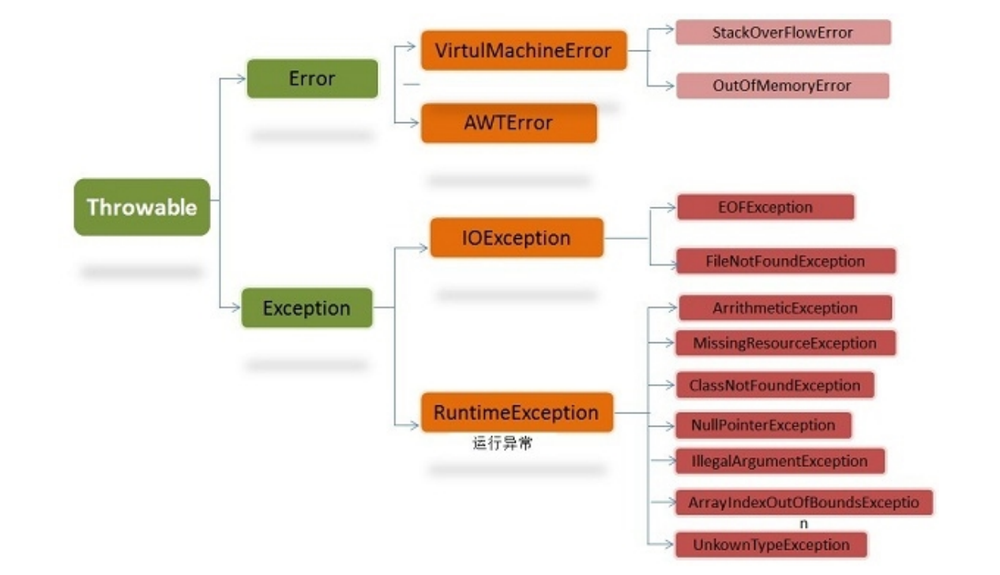

# 【异常】

**1. throw 和 throws 的区别？**

* throw 是真实抛出一个异常；
* throws 是声明可能会抛出一个异常。

**2. final、finally、finalize 有什么区别？**

* final：是修饰符，可以修饰类、方法、变量，如果修饰类，此类不能被继承；如果修饰方法，此方法不能被重写（override）；如果修饰变量，则该变量是不可修改的，即变量变成常量。
* finally：是 try-catch-finally 最后一部分，表示不论发生什么情况都会执行（除非在finally 之前执行 System.exit\(\)方法），常用于释放资源或锁。
* finalize：是Object 类的一个方法，在垃圾收集器执行的时候会调用被回收对象的该方法。finalize 机制现在已经不推荐使用。

**3. try-catch-finally 中哪个部分可以省略？**

try-catch-finally 其中 catch 和 finally 都可以被省略，但是不能同时省略，也就是说有 try 的时候，必须后面跟一个 catch 或者 finally。

**4. try-catch-finally 中，如果 catch 中 return 了，finally 还会执行吗？**

finally 一定会执行，即使是catch 中return 了，catch 中的return 会等finally 中的代码执行完之后，才会执行。

> 在以下 4 种特殊情况下，finally 块不会被执行： 
>
> 1. 在 finally 语句块中发生了异常。 
>
> 2. 在前面的代码中用了 System.exit\(\)退出程序。 
>
> 3. 程序所在的线程死亡。 
>
> 4. 关闭 CPU。

**5. 常见的异常类有哪些？**

* NullPointerException 空指针异常
* ClassNotFoundException 指定类不存在
* NumberFormatException 字符串转换为数字异常
* IndexOutOfBoundsException 数组下标越界异常
* ClassCastException 数据类型转换异常
* FileNotFoundException 文件未找到异常
* NoSuchMethodException 方法不存在异常
* IOException IO 异常
* SocketException Socket 异常

#### 6.Java 异常类层次结构图

在 Java 中，所有的异常都有一个共同的祖先 java.lang 包中的 Throwable 类。Throwable： 有两个重要的子类：Exception（异常） 和 Error（错 误） ，二者都是 Java 异常处理的重要子类，各自都包含大量子类。 Error（错误）:是程序无法处理的错误，表示运行应用程序中较严重问题。大 多数错误与代码编写者执行的操作无关，而表示代码运行时 JVM（Java 虚拟 机）出现的问题。例如，Java 虚拟机运行错误（Virtual MachineError），当 JVM 不再有继续执行操作所需的内存资源时，将出现 OutOfMemoryError。这 些异常发生时，Java 虚拟机（JVM）一般会选择线程终止。 这些错误表示故障发生于虚拟机自身、或者发生在虚拟机试图执行应用时，如 Java 虚拟机运行错误（Virtual MachineError）、类定义错误 （NoClassDefFoundError）等。这些错误是不可查的，因为它们在应用程序的

控制和处理能力之 外，而且绝大多数是程序运行时不允许出现的状况。对于设 计合理的应用程序来说，即使确实发生了错误，本质上也不应该试图去处理它 所引起的异常状况。在 Java 中，错误通过 Error 的子类描述。 Exception（异常）:是程序本身可以处理的异常。Exception 类有一个重要的 子类 RuntimeException。RuntimeException 异常由 Java 虚拟机抛出。 NullPointerException（要访问的变量没有引用任何对象时，抛出该异常）、 ArithmeticException（算术运算异常，一个整数除以 0 时，抛出该异常）和 ArrayIndexOutOfBoundsException （下标越界异常）。 注意：异常和错误的区别：异常能被程序本身可以处理，错误是无法处理。 

Throwable 类常用方法 

* public string getMessage\(\):返回异常发生时的详细信息 
* public string toString\(\):返回异常发生时的简要描述
* public string getLocalizedMessage\(\):返回异常对象的本地化信息。使 用 Throwable 的子类覆盖这个方法，可以声称本地化信息。如果子类没 有覆盖该方法，则该方法返回的信息与 getMessage（）返回的结果相同
* public void printStackTrace\(\):在控制台上打印 Throwable 对象封装的 异常信息 异常处理总结
* try 块：用于捕获异常。其后可接零个或多个 catch 块，如果没有 catch 块，则必须跟一个 finally 块。 
* catch 块：用于处理 try 捕获到的异常

