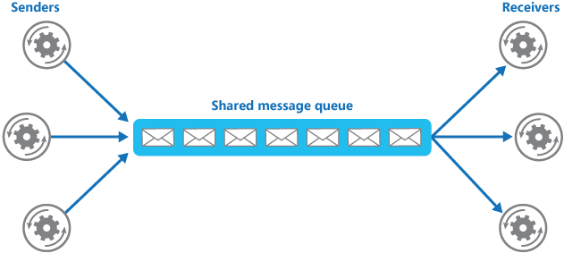
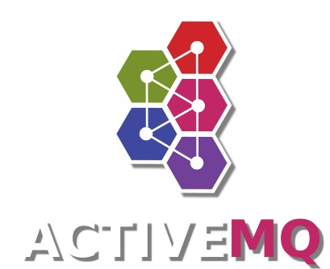

# 【MQ】

### [【MQ】](./)

### 参考地址

相关面试题参考地址：

[https://blog.csdn.net/zhengzhaoyang122/article/details/82184007](https://blog.csdn.net/zhengzhaoyang122/article/details/82184007)

[https://blog.csdn.net/songfeihu0810232/article/details/78648706](https://blog.csdn.net/songfeihu0810232/article/details/78648706)

作为中间件，消息队列是分布式应用间交换信息的重要组件。消息队列可驻留在内存或磁盘上, 队列可以存储消息直到它们被应用程序读走。通过消息队列，应用程序可以在不知道彼此位置的情况下独立处理消息，或者在处理消息前不需要等待接收此消息。所以消息队列可以解决应用解耦、异步消息、流量削锋等问题，是实现高性能、高可用、可伸缩和最终一致性架构中不可以或缺的一环。下面对消息队列就直接使用MQ表示。

现在比较常见的MQ产品主要是ActiveMQ、RabbitMQ、ZeroMQ、Kafka、MetaMQ、RocketMQ，当然还有很多其他的产品。因为个人水平有限，就简单的比较下这几种MQ的优缺点，作为自己选型的参考。

## ZeroMQ 

> ZeroMQ \(also known as ØMQ, 0MQ, or zmq\) looks like an embeddable networking library but acts like a concurrency framework. It gives you sockets that carry atomic messages across various transports like in-process, inter-process, TCP, and multicast. You can connect sockets N-to-N with patterns like fan-out, pub-sub, task distribution, and request-reply. It’s fast enough to be the fabric for clustered products. Its asynchronous I/O model gives you scalable multicore applications, built as asynchronous message-processing tasks. It has a score of language APIs and runs on most operating systems. ZeroMQ is from iMatix and is LGPLv3 open source.

ZeroMQ号称是“史上最快的消息队列”，基于c语言开发的，可以在任何平台通过任何代码连接，通过inproc、IPC、TCP、TIPC、多播传送消息，支持发布-订阅、推-拉、共享队列等模式，高速异步I/O引擎。

根据官方的说法，ZeroMQ是一个简单好用的传输层，像框架一样的可嵌入的socket类库，使Socket编程更加简单、简洁、性能更高，是专门为高吞吐量/低延迟的场景开发的。ZeroMQ与其他MQ有着本质的区别，它根本不是消息队列服务器，更类似与一个底层网络通讯库，对原有Socket API进行封装，在使用的使用引入对应的jar包即可，可谓是相当灵活。

同时，因为它的简单灵活，如果我们想作为消息队列使用的话，需要开发大量代码。而且，ZeroMQ不支持消息持久化，其定位并不是安全可靠的消息传输，所以还需要自己编码保证可靠性。简而言之一句话，ZeroMQ很强大，但是想用好需要自己实现。

## RabbitMQ 

> 官方定义：
>
> * Robust messaging for applications
> * Easy to use
> * Runs on all major operating systems
> * Supports a huge number of developer platforms
> * Open source and commercially supported

RabbitMQ是基于Erlang语言编写的开源消息队列，通过Erlang的Actor模型实现了数据的稳定可靠传输。本身是实现AMQP的消息队列，因此官方推荐，如果仅仅是使用RabbitMQ的话，建议使用AMQP 0-9-1的协议。不过，因为其可扩展性，可以通过插件的形式使用STOMP、XMPP、AMQP 1.0，还可以通过插件使用HTTP这种非消息的传输协议。所以，RabbitMQ可以说是适应性非常强的一个消息队列中间件了。

当然，不仅是协议支持的多，还因为它实现了代理\(Broker\)架构，意味着消息在发送到客户端之前可以在中央节点上排队。此特性使得RabbitMQ易于使用和部署，适宜于很多场景如路由、负载均衡或消息持久化等，用消息队列只需几行代码即可搞定。但是，这使得它的可扩展性差，速度较慢，因为中央节点增加了延迟，消息封装后也比较大，如需配置RabbitMQ则需要在目标机器上安装Erlang环境。

总的来说，RabbitMQ在数据一致性、稳定性和可靠性方面比较优秀，而且直接或间接的支持多种协议，对多种语言支持良好。但是其性能和吞吐量差强人意，由于Erlang语言本身的限制，二次开发成本较高。

## ActiveMQ 

> Apache ActiveMQ ™ is the most popular and powerful open source messaging and Integration Patterns server.
>
> Apache ActiveMQ is fast, supports many Cross Language Clients and Protocols, comes with easy to use Enterprise Integration Patterns and many advanced features while fully supporting JMS 1.1 and J2EE 1.4. Apache ActiveMQ is released under the Apache 2.0 License.

ActiveMQ介于ZeroMQ和RabbitMQ之间。类似于ZeroMQ，它可以部署于代理模式和P2P模式。类似于RabbitMQ，它易于实现高级场景，而且只需付出低消耗。被誉为消息中间件的“瑞士军刀”。

支持OpenWire、Stomp、AMQP v1.0、MQTT v3.1、REST、Ajax、Webservice等多种协议；完全支持JMS1.1和J2EE 1.4规范（事务、持久化、XA消息）；支持持久化到数据库。但是ActiveMQ不够轻巧，而且对于队列较多的情况支持不好，据说还有丢消息的情况。

目前已经有了其下一代消息产品Apollo。

## Apollo 

> ActiveMQ Apollo is a faster, more reliable, easier to maintain messaging broker built from the foundations of the original ActiveMQ. It accomplishes this using a radically different threading and message dispatching architecture. Like ActiveMQ, Apollo is a multi-protocol broker and supports STOMP, AMQP, MQTT, Openwire, SSL, and WebSockets.

Apache称Apollo为最快、最强健的STOMP服务器。支持STOMP、AMQP、MQTT、OpenWire协议，支持Topic、Queue、持久订阅等消费形式，支持对消息的多种处理，支持安全性处理，支持REST管理API。。。功能列表很长，最大的弊病就是目前市场接收度不够，所以使用的并不广泛。

## Kafka 

> Kafka™ is used for building real-time data pipelines and streaming apps. It is horizontally scalable, fault-tolerant, wicked fast, and runs in production in thousands of companies.

Kafka是LinkedIn于2010年12月开发并开源的一个分布式流平台，现在是Apache的顶级项目，是一个高性能跨语言分布式Publish/Subscribe消息队列系统，以Pull的形式消费消息。具有以下特性：快速持久化，可以在O\(1\)的系统开销下进行消息持久化；高吞吐，在一台普通的服务器上既可以达到10W/s的吞吐速率；完全的分布式系统，Broker、Producer、Consumer都原生自动支持分布式，自动实现复杂均衡。因为设计之初是作为日志流平台和运营消息管道平台，所以实现了消息顺序和海量堆积。

Kafka自身服务与消息的生产和消费都依赖与Zookeeper，使用Scala语言开发。因为其消息的消费使用客户端Pull方式，消息可以被多个客户端消费，理论上消息会重复，但是不会丢失（除非消息过期）。因此比较常用的场景是作为日志传输的消息平台。

## RocketMQ 

> Apache RocketMQ™ is an open source distributed messaging and streaming data platform.

RocketMQ是阿里开源的消息中间件，目前在Apache孵化，使用纯Java开发，具有高吞吐量、高可用性、适合大规模分布式系统应用的特点。RocketMQ思路起源于Kafka，但并不是简单的复制，它对消息的可靠传输及事务性做了优化，目前在阿里集团被广泛应用于交易、充值、流计算、消息推送、日志流式处理、binglog分发等场景，支撑了阿里多次双十一活动。

因为是阿里内部从实践到产品的产物，因此里面很多接口、api并不是很普遍适用。其可靠性毋庸置疑，而且与Kafka一脉相承（甚至更优），性能强劲，支持海量堆积。不过据说，没有在mq核心上实现JMS，但是也无伤大雅。

## 总结

其实对于这些消息队列的产品，每一种都在某一领域占有一席，虽然ActiveMQ目前在社区已经不是很活跃，但是其下一代产品Apollo已经问世。ZeroMQ小而美，RabbitMQ大而稳，Kakfa和RocketMQ快而强劲。RocketMQ虽然目前还很多不完善，但是一旦在Apache孵化成为顶级项目，全球程序猿开始贡献，前途也是不可限量的。

